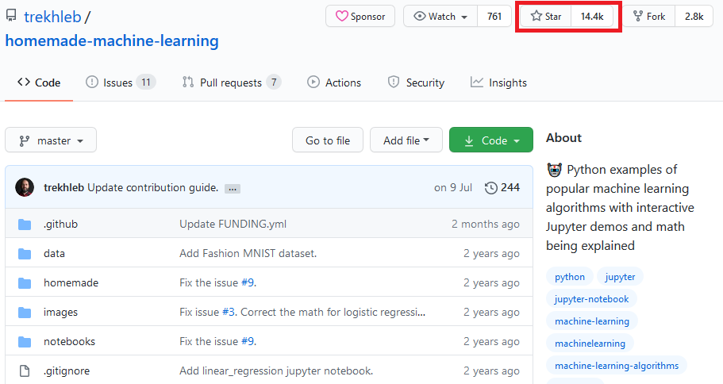
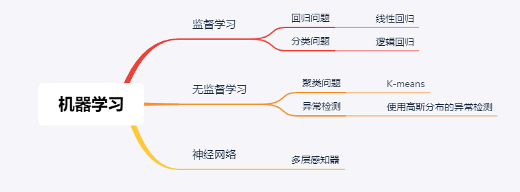
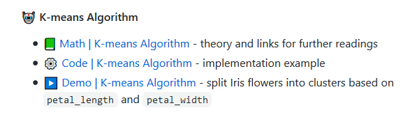
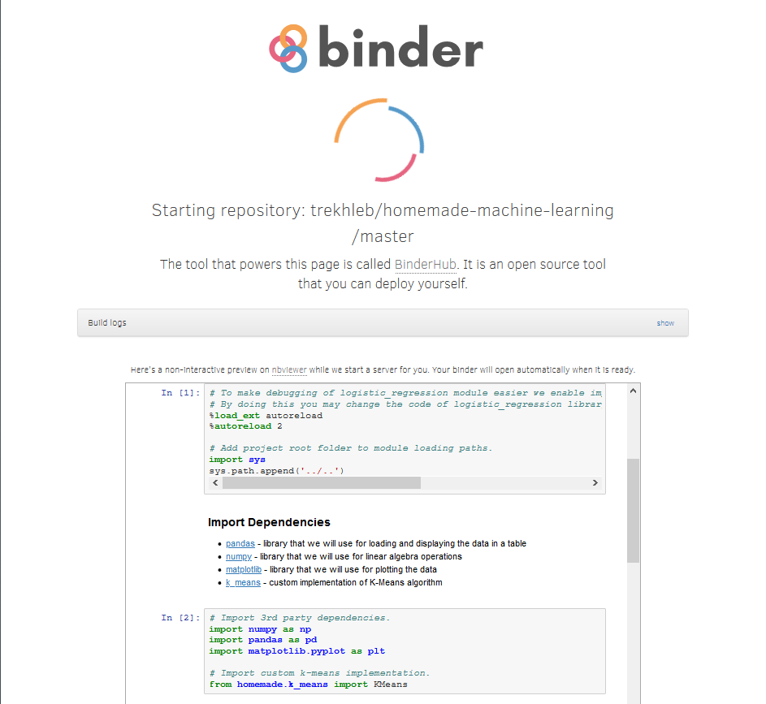
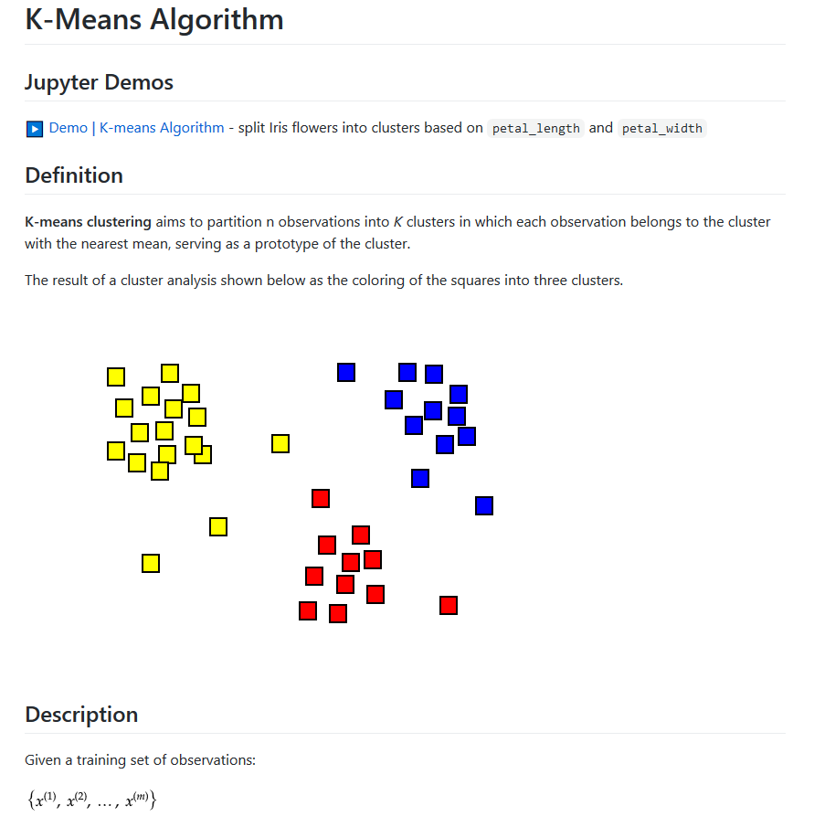
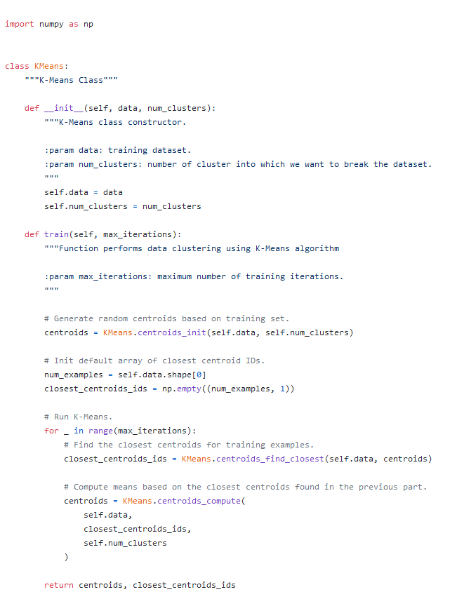
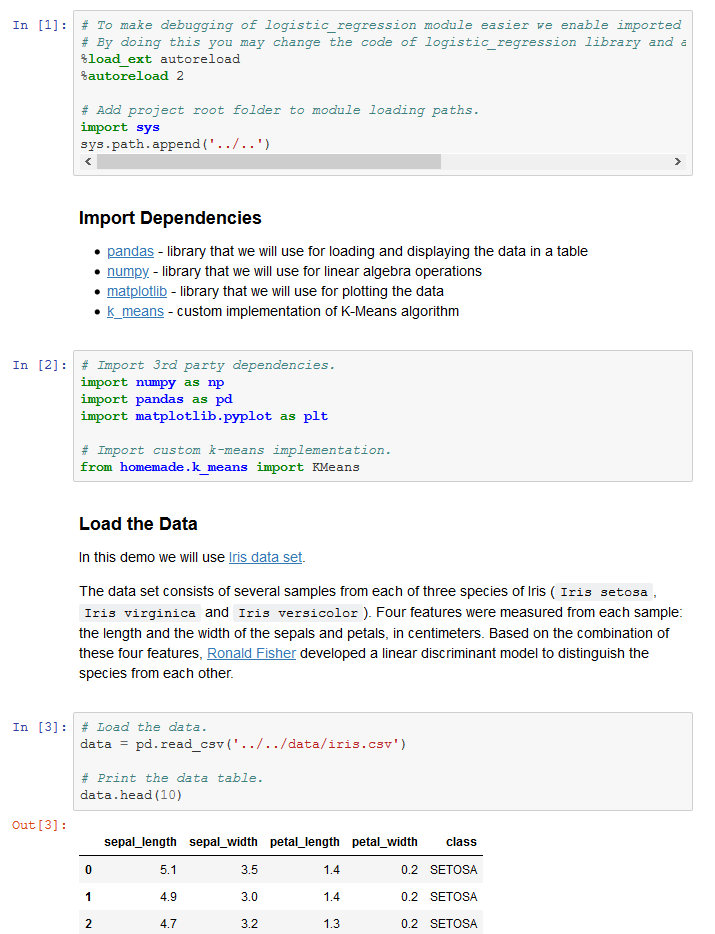

# GitHub热榜，推荐一个非常不错的机器学习指南

机器学习无疑是现在最火的方向之一，许多新手不知道如何入手？不能对概念进行理解？看不懂代码？今天小编带你进入一个机器学习的**交互式学习**项目，让你轻松入门！

该项目在github中备受欢迎，其包含了常见流行的机器学习算法的实现以及其数学解释，其数学解释主要是机器学习大牛[吴恩达](https://baike.baidu.com/item/%E5%90%B4%E6%81%A9%E8%BE%BE/9465313?fr=aladdin)机器学习课程中的解释，通俗易懂。



这个项目已经在github中**获得了14.4K的star,以及2.8k的fork**，让我们一起来探索下，开启机器学习的杀怪之路！


## 01 安装选择
该仓库基于python现有的仓库进行，只需要对应安装以下库，将仓库下载至本地即可食用
jupyter == 1.0.0
matplotlib == 3.0.1
numpy == 1.15.3
pandas == 0.23.4
plotly == 3.4.1
pylint == 2.1.1
scipy == 1.1.0
这里面仓库只需要下面命令即可安装，小编这里添加了清华源镜像，方便大家安装
```
pip install * -i  https://pypi.tuna.tsinghua.edu.cn/simple
```
如果您对**jupyter**不太熟悉，这里有一份[链接](https://www.cnblogs.com/sui776265233/p/11607939.html#_label1)可以快速入门

**注意**：
如果您想快速安装，在下载该仓库后，直接在根目录运行以下命令可以直接安装，如果遇到问题，可选择上面进行单独安装进行问题的排查
```
pip install -r requirements.txt
```

## 02 内容介绍
机器学习包含了监督学习，非监督学习，神经网络等部分，此项目在每个部分都选取了经典的算法进行了理论与实践的讲解，之后还提供了一份**机器学习路线图**，以供后续学习参考。


下面对仓库的具体内容进行介绍,小编对仓库中的内容进行了简单的概括，如下图所示，对于机器学习的每一方面进行了一到两个算法的讲解实战，是简单的入门教程，如果想要深入学习，需要按照上面的学习路线图进行更深一步的学习噢！


对于仓库中的每一个涉及到的每一个算法，其都包含三个部分:数学推导，代码解析，示例演示，其中都有详细介绍，可方便阅读，但小伙伴要注意是英文的噢！


## 03 使用介绍
该项目提高提供在线观看，下载到本地使用两种方式。
- **在线学习**
读者只需要打开主页的相应链接便可进行学习。该项目中的算法但都包含了Jupyter NBViewer的演示链接。这是Jupyter笔记本电脑的快速在线预览器，可以在浏览器中直接看到演示代码，图表和数据，而无需在本地安装任何内容。如果想更改代码并试用演示笔记本，则需要在Binder中启动笔记本。可以通过简单地单击NBViewer右上角的图标执行。


小编在网页端进行代码修改测试的页面如下

- **本地使用**
下载到本地之后，直接在根目录运行以下命令，便可在本地浏览器进行学习。
```
jupyter notebook
```

## 04 示例学习
在这里选取其中一个典型代表进行解析，选取无监督学习中的K-means方法进行举例。K-means是指将n个观测值划分为k个聚类，使得组内平方和最小，从而完成聚类的方法。在这里小编根据提示进行了学习思路的整理，主要包含理论--代码--实践三个方面，大家可以参考这个方式进行学习。
- **1>理论学习**
首先是理论学习，其界面图文并茂，详细介绍了K-means算法要解决的问题，以及其对应的数学描述。


- **2>代码构建**
在k-means.py文件中，构建了KMeans类，其初始化输入为要处理的数据data以及要分为的类别数num_clusters,并构建了相应的类方法进行K-means算法的构造，每一行都有英文解释，方便理解。


- **3>数据实践**
在k-means.py文件构造完成后，在k_means_demo.ipynb是对该算法进行示例演示的demo，该演示是在jupyter notebook环境中进行，使得可以进行程序交互，我们可以看到每一步程序执行之后的数据变化，对于每一步代码的理解是十分有帮助的，其中用到的数据集在data文件夹均有提供。



***
好了，小编的探索到这里就结束了，总之这个仓库还是十分值得学习的，对于机器学习中常见的算法都进行了详细的解释教学，对于一个机器学习的初学者十分友好，包含了图表数据演示，但想要在机器学习领域一展拳脚，单靠这个项目是不行的，需要大家按照学习路线更深一步的学习，小伙伴们Fighting！


链接：https://github.com/trekhleb/homemade-machine-learning
此外，这个项目包含了matlab（octave）版本，大家可以根据自己的需求进行选择