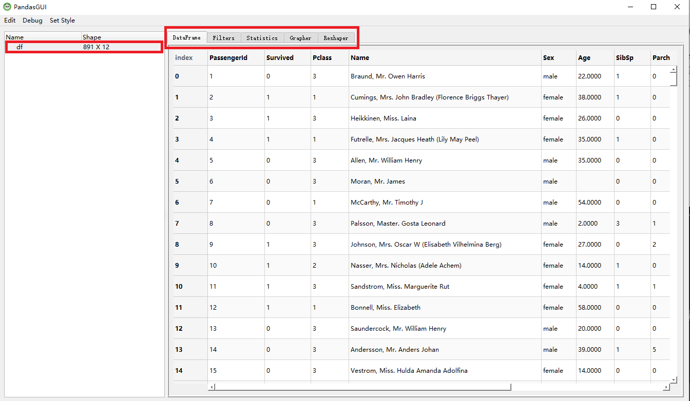
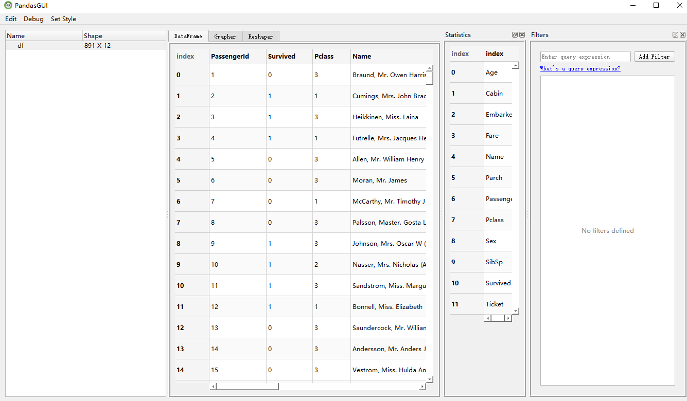
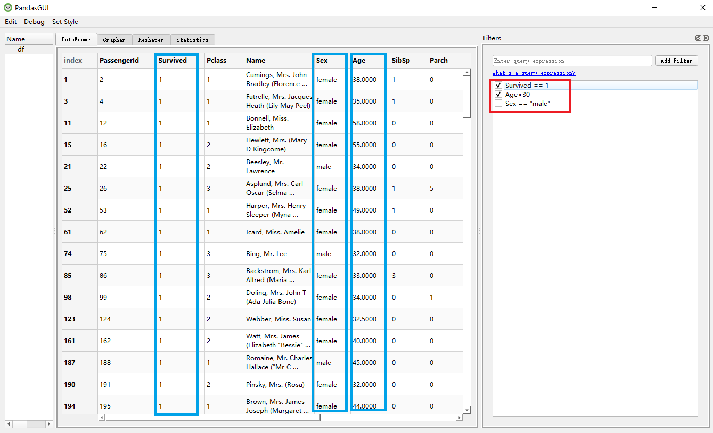
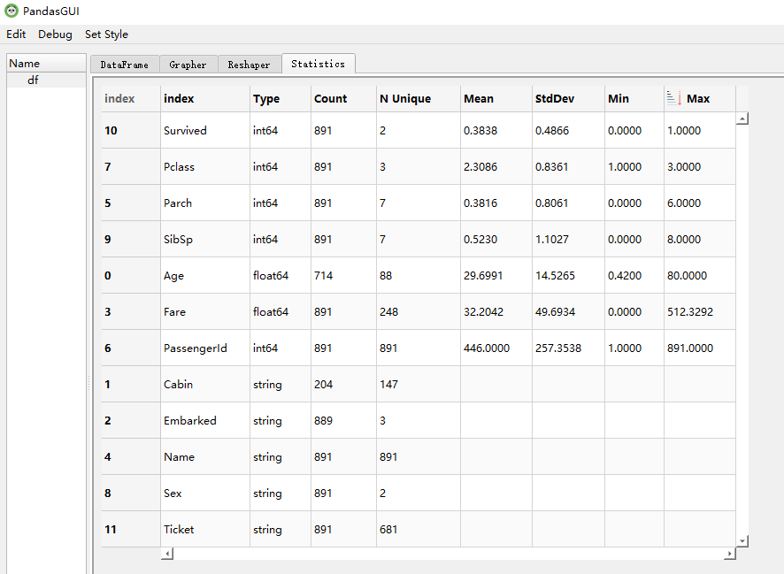
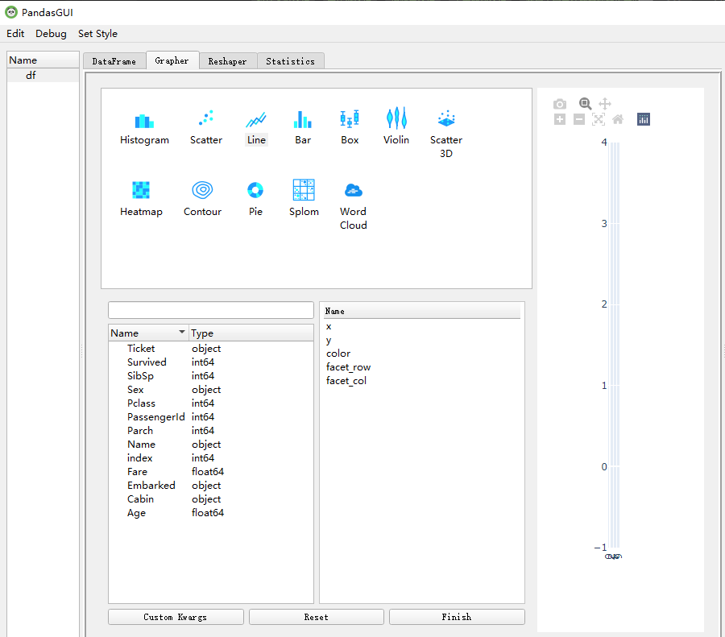
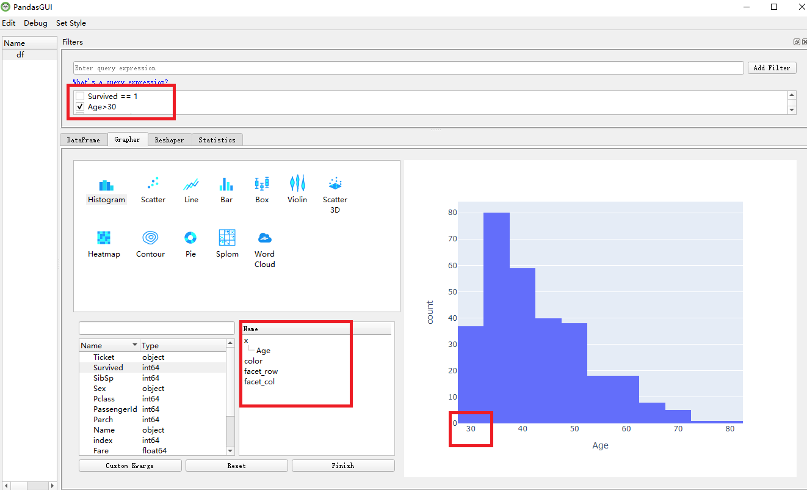
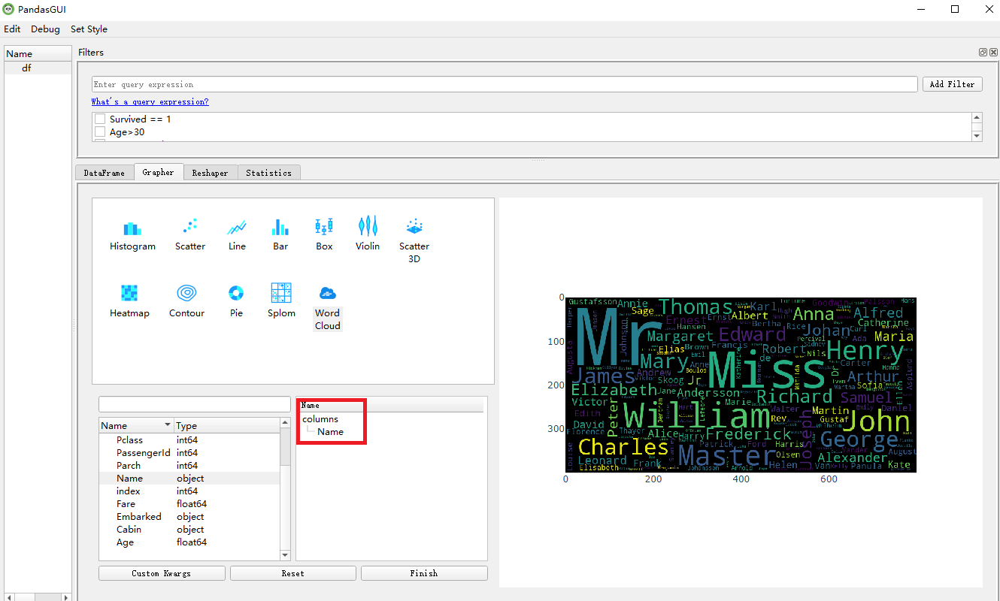
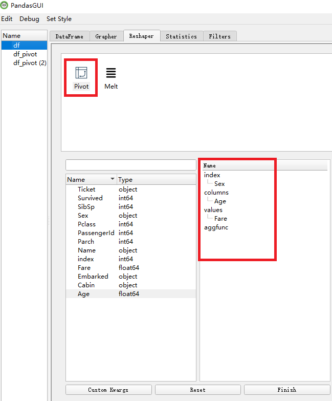
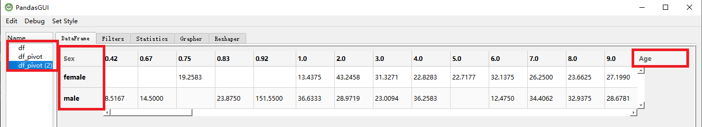

# Pandas可视化来了
Pandas一定是大家非常非常熟悉得一个库了，相信大家也能熟练掌握。它作为Python 语言开发的用于**数据处理**（data manipulation）和**数据分析**（data analysis）的第三方库，在处理数字型数据和时间序列数据方面拥有极大的优势，受到数据科学开发者的广大欢迎。

今天小编要介绍的这一个库，名为**PandasGUI**，顾名思义，就是Pandas的可视化实现，可以进一步提高我们解决问题的效率，方便快捷。

## 01 PandasGUI介绍
- 官方解释
用于分析Pandas DataFrames的图形化界面。
由官方解释可以看出其主要对pandas中的DataFrames数据进行操作，DataFrames是数据分析中最常用的数据类型之一。

- 安装步骤
其安装步骤十分简单，只需要使用pip命令安装即可，会自动安装qt等需要的包，但是也会出现有一些涉及到的包未安装的情况，小编在使用的时候就遇到了wordcloup未安装的情况，自行进行安装即可。大家如果遇到别的包未安装，请自行进行安装。

```
pip install pandasgui
```
- 使用方式
官方提供启动PandasGUI的方式，代码也十分简单,只需要导入相关库，获取DataFrames数据并显示就好了。示例代码如下：
```python
import pandas as pd
from pandasgui import show
df = pd.read_csv("train.csv")
show(df, settings={'block': True})
```
但是要**注意**的是：
在IPython或Jupyter中，使用下面命令即可调用出PandasGUI；
```python
show(df)
```
但是使用脚本或在ide中，需调用如下命令，否则界面会立刻退出。
```python
show(df, settings={'block': True})
```


-  功能特点：
PandasGUI是一个交互式的数据操作界面，类似于Excel，但是其对于数据处理更加方便快捷，共拥有7项功能特点。
1.查看DataFrames和Series数据
2.交互式绘图
3.数据筛选
4.统计摘要
5.数据编辑和复制/粘贴
6.拖放导入CSV文件
7.搜索工具栏


- 官方demo:
下面为官方demo展示，第一个网页在Youtobe，需要科学上网，第二个为微博博主GithubDaily搬运到国内的视频地址，内网即可访问，有兴趣的同学可以前往查看。
https://www.youtube.com/watch?v=NKXdolMxW2Y
https://weibo.com/tv/show/1034:4563118169456671?from=old_pc_videoshow

## 02 PandasGUI使用

这里小编读取了Kaggle中泰坦尼克号的数据作为DataFrames进行演示。

在首页中我们可以看到数据的大小维数（第一个红框）891*12，以及我们选择的六个菜单栏：DataFrame，Filters，Statistics，Grapher，Reshaper等，六个菜单栏可以按照自己所需调整到不同区域方便操作。

上图展示小编将过滤器和统计调整在右边的画面，大家可根据需求进行自行调整，下面将对菜单栏分别进行学习操作。

- DataFrame
这里对数据进行展示，当我们想要查看数据时，点击DataFrame便可查看。
- Filters
数据筛选，这是一个可以根据输入条件对数据进行初步筛选的交互界面，只需要将条件输入框中，点击ADD Filter按钮即可，在这里，小编输入了Survived == 1、Age>30、Sex == "male"三个条件，但是之选中了其中两个条件，其过滤结果如下图所示。


- Statistics
统计菜单栏显示了数据各个变量之间的统计结果，包含了每个变量的数据类型，总数，平均值，最大值，最小值等。



- Grapher
画图菜单栏,提供了直方图、散点图、折线图、饼状图、词云等12种图像格式，用户可以根据需求选取变量绘制相应的图形。

下面以直方图和词云为例子向大家进行展示。

上图绘制了年龄大于30的船上游客的年龄直方图，可以看到Filter工具在画图时仍可以同时使用。

上图以名字为例子，绘制了船上人员名字的词云图。

- Reshaper
Reshaper菜单栏展示了了对原始数据进行重新组合为新DataFrames的功能。它包含了DataFrames的基本属性，实际上代表了DataFrames的两个方法，df.melt(),df.pivot()，以图像化的形式进行了展现。
这里以pivot进行展示：
pivot()参数：
values：对应的二维NumPy值数组。
columns：列索引：列名称。
index：行的索引：行号或行名。
aggfun: 使用方法

上图中以Sex为行索引，Age为列索引，Fare系统值，操作后的表格展示为：

在上图中，我们可以看到，在最左边增加了df_pivot的DataFrames数据，每操作一次，会增加一个DataFrames数据，并在左边显示，新增之后的DataFrames数据依然适用于之前所有的操作。此外，新生成的DataFrames可以直接拖拽在文件夹生成新的csv文件，保存方便。

***
到这里，小编的探索就结束了，有了这个工具，大家就可以像操作Excel一样操作Dataframe数据，迅速获取有用的信息，不知道大家有没有心动呢！