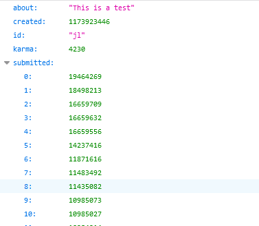
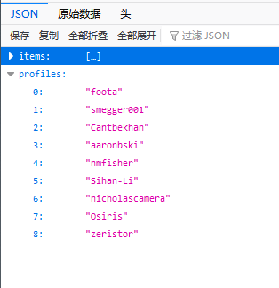
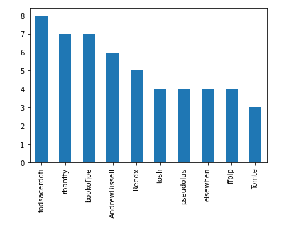

#  使用Hacker News API 爬取Hacker News网站信息
Hacker News译为中文为黑客的新闻，看到**黑客** 这个词语，总带着一丝神秘，相信每个程序员都有成为一名黑客的梦想，小编当然也有这个梦想。
在**维基百科**中，我们可以看到其对Hacker News的描述：Hacker News 是一家关于**计算机黑客和创业公司的社会化新闻网站**，由保罗·格雷厄姆的创业孵化器 Y Combinator 创建。与其它社会化新闻网站不同的是 Hacker News 未登录访客没有赞成或反对一条提交新闻的选项，不过还是可以被有足够 Karma 的用户投赞成或反对票。简而言之，Hacker News 允许提交任何可以被理解为“任何满足人们求知欲”的新闻。

从维基百科的介绍中我们就可以看到，这个网站的特性，自由开放、兼容并包。

“黑客”们都关注什么新闻呢，今天小编带大家一探究竟。

## 01 Hacker News API介绍
在探索Hacker News的过程中，小编发现一个关于该网站的API接口，该接口与Firebase合作，可以实时地提供公共的Hacker News数据，利用该接口，可以快速爬取网站数据。该接口的链接如下：
https://github.com/HackerNews/API


该API提供了数据接口
https://hacker-news.firebaseio.com/v0/
其中V0是API的版本号，所有信息都是基于这个接口添加后缀进行。下面将进行展示。

### a 信息接口
在接口后输入/v0/item/id.json，其中id指定信息的唯一id，便可访问该信息的相关属性。

每条信息包含以下属性
|属性|描述|
|:-:|:-:|
|id|文章对应的唯一id|
|deleted|如果是True，该文章已被删除|
|type|文章类型包含"job", "story", "comment", "poll"，"pollopt"|
|by|作者|
|time|创建时间（Unix Time）|
|text|评论，故事或民意调查文本或网页|
|dead|如果是True，项目已死|
|parent|评论的上一级：另一个评论或相关故事|
|poll|相关民意调查|
|kids|项目评论的ID（按显示顺序排列）|
|url|故事的网页|
|score|故事的得分或民意测验的投票|
|title|标题|
|parts|按显示顺序排列的相关pollopts列表|
|descendants|对于故事或民意测验，总评论数|


### b 用户信息
在接口后面接入/v0/user/user.json,便可访问用户消息。

每条信息包含以下属性
|属性|描述|
|:-:|:-:|
|id|用户的位移用户名，区分大小写|
|delay|从创建评论到其他用户可见之间的时间延迟（单位分钟）|
|created|用户的创建时间（Unix Time）|
|karma|用户的karma|
|about|用户的个人描述|
|submitted|用户的提交，包含故事，民意测验和评论等|


### c 实时数据
API中还


#### 最新文章
在接口后面接入/v0/user/maxitem.json,便可查看最新的文章id。

由上图可以看到，最新的提交id为24853944，之前的提交都在这个id之前。
#### 最热门的故事
- 在接口后面接入/v0/user/topstories.json,便可查看最热门的500个故事。
- 在接口后面接入/v0/user/newstories.json,便可查看最新的500个故事。
- 在接口后面接入/v0/user/beststories.json,便可查看最好的500个故事。


#### 最新的Ask HN、Show HN、 Job stories
在接口后面接入/v0/user/askstories.json（showstories.json、jobstories.json）,便可查看最热门Ask HN、Show HN、 Job stories，获取为文章的id，和最热门的故事类似。

#### 项目和配置文件的更新
在接口后面接入/v0/user/updates.json



## 02 API的调用
小编这里调用/v0/topstories.json，查看Hacker News中最热门的信息id，再根据id，在调用信息接口/v0/item/<id>.json获取该信息的相关介绍，并对其进行简单分析。
```python
import requests
import pandas as pd

# 获取网页的延时与请求次数
def gethtml(url):
  i = 0
  while i < 5:
    try:
      html = requests.get(url, timeout=5)
      return html
    except requests.exceptions.RequestException:
      i += 1


#执行API调用并储存响应
url = 'https://hacker-news.firebaseio.com/v0/topstories.json'
r = requests.get(url)
print("Status Code : ",r.status_code)

submisssion_dicts = []
#获取news的id
submisssion_ids = r.json()
# print(submisssion_ids)
print(submisssion_ids)
# 信息的相关属性
shuixng = ['by', 'descendants', 'id', 'kids', 'score', 'time', 'title', 'type', 'url']
for submisssion_id in submisssion_ids:
    # 处理有关每篇文章的信息
    url = 'https://hacker-news.firebaseio.com/v0/item/'+str(submisssion_id)+'.json'

    try:
        submisssion_r = gethtml(url)
    except Exception:
        print(url)
    # 获取的为字典类型数据
    response_dict = submisssion_r.json()
    # 将字典类型数据添加到列表
    submisssion_dicts.append(response_dict)
# 字典列表转为dataframe 并存入data.csv
data_df = pd.DataFrame(submisssion_dicts)
data_df.to_csv('data.csv')
```
上面便是完整的获取Hacker News中top500的文章的相关信息，由于Hacker News是国外的网站，需要**科学上网**，为了解决requests对网页读取等待时间过长而卡住，小编这里使用了gethtml函数，再等待5秒后无响应，重新进行请求，5次之后仍没有结果则跳过。

上图展示的小编爬到的相关信息，接下来小编就带大家一起看一看所有信息中哪一种类型的信息最受欢迎。
在小编爬取的数据中共有449条有效数据，其中种类story占比99.78%，job为0.22%，可见story是haceker们最喜欢的类型。


接下来小编再首页中文章数量最多的作者进行了展示，todsacerdoti、rbanffy、bookofjoe、AndrewBissell、Reedx是排名前五的作者，不知道有没有大家喜欢的作者呢。


***
到这里，小编的探索介绍就结束了，大家如果感兴趣的话，可以去该网站看看Hacker们喜欢的文章，不知道大家会不会喜欢呢！