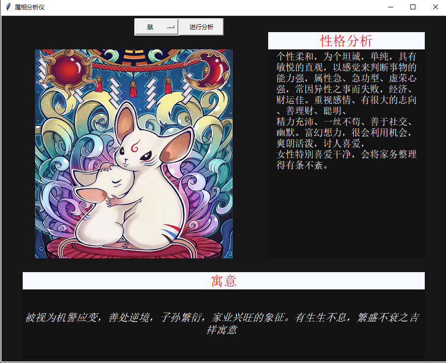
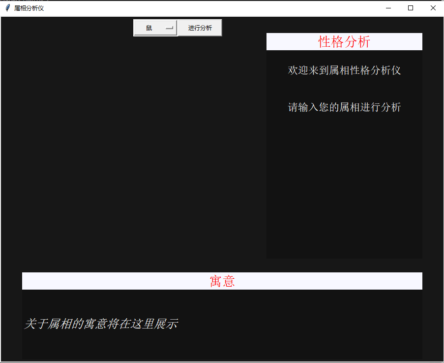
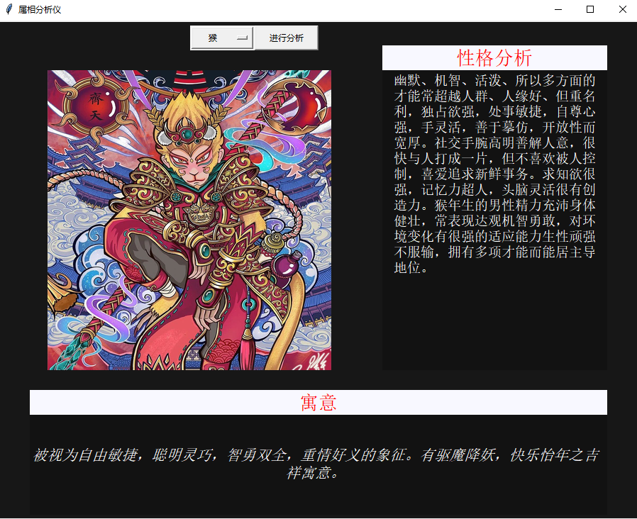

 # 利用python制作属相分析仪

 在我们出生的那一天，我们的生肖就定下了。生肖是我国特有的民俗文化符号，是中国与十二地支相配以人出生年份的十二种动物，先秦时期我国便有了比较完整的生肖系统，随着历史的发展逐渐融合到相生相克的民间信仰观念，表现在婚姻、人生、年运等，每一种生肖都有丰富的传说，并以此形成一种观念阐释系统，成为民间文化中的形象哲学，如婚配上的属相、庙会祈祷、本命年等。现代，更多人把生肖作为春节的吉祥物，成为娱乐文化活动的象征。

 

 大家都是什么生肖呢？今天小编就用python的tkinter制作了一个属相分析仪，能够对属相进行寓意解释和性格分析，大家快来看一看它有没有说中吧。

## 01 tkinter的使用
tkinter库是python中的自带轻量级的跨平台图形用户界面 (GUI)开发工具，是python最简单的GUI库，常用新手练手使用，它包含了一般GUI库应有的大部分部件，开发也遵循常用GUI库的通用规则，这里不作详细介绍，小编为大家找了两个比较好的教程，有兴趣的可以前往查看学习。
https://www.runoob.com/python/python-gui-tkinter.html
http://www.bczl.xyz/tkinter/doc/

常用控件明细
```
Lable：标签
Button：按钮
Entry：输入框
Text：文本框
Checkbutton: 多选框
Menu:菜单栏
Radiobutton: 单选框
Scrol lbar：滚动条
```

## 02 分析仪的制作
要制作属相分析仪，首先要在网上搜寻关于属相相关分析的资料、图片，小编经过精挑细选，最终选择一些适合的素材（素材均来源于网络）。有了素材之后，小编需要做的边是界面的划分以及交互的设计，下面将进行详细介绍。

### a 界面设计
依据小编的思路，主要将界面划分为四大部分，按键互动，图片显示，寓意显示，以及性格分析，下面代码是对界面的初步划分。
```python
HEIGHT = 700
WIDTH = 900

root = tk.Tk()
root.title('属相分析仪')

canvas = tk.Canvas(root, height=HEIGHT, width=WIDTH, bg='#171717')
canvas.pack()

desc_frame_name = tk.Frame(root, bg='#F8F8FF')             
# relx/y  表示偏移量    relheight/relwidth表示大小
desc_frame_name.place(relx=0.6, rely=0.05, relheight=0.05, relwidth=0.35)


desc_frame = tk.Frame(root, bg='#121212')             
# relx/y  表示偏移量    relheight/relwidth表示大小
desc_frame.place(relx=0.6, rely=0.1, relheight=0.6, relwidth=0.35)

fact_frame_name = tk.Frame(root, bg='#F8F8FF')
fact_frame_name.place(relx=0.05, rely=0.74, relheight=0.05, relwidth=0.9)


fact_frame = tk.Frame(root, bg='#121212')
fact_frame.place(relx=0.05, rely=0.79, relheight=0.2, relwidth=0.9)

option = ['鼠','牛','虎','兔','龙','蛇','马','羊','猴','鸡','狗','猪'] 
clicked = StringVar()
clicked.set(option[0])  # 设置默认值
drop = OptionMenu(root, clicked, *option)
drop.place(relx=0.3, rely=0.01, relheight=0.05, relwidth=0.1)


planet_type = clicked.get()  #获取枚举
button = tk.Button(canvas, text='进行分析')
button.bind('<Button-1>', annimal_process) # 案件函数的绑定
button.place(relx=0.4, rely=0.01, relheight=0.05, relwidth=0.1)


text2 = '关于属相的寓意将在这里展示'

text = """
欢迎来到属相性格分析仪


请输入您的属相进行分析

"""

initial_label3 = tk.Label(desc_frame_name, text="性格分析",justify="center" ,font=('Gadugi', 20), bg='#F8F8FF', fg='red')
initial_label3.pack(side='top')


initial_label2 = tk.Label(fact_frame, text=text2, font=('Monotype Corsiva', 18), bg='#121212', fg='white')
initial_label2.pack(side='left')

initial_label4 = tk.Label(fact_frame_name, text="寓意", justify="center",wraplength = 300,font=('Gadugi', 20), bg='#F8F8FF', fg='red')
initial_label4.pack()

initial_label = tk.Label(desc_frame, text=text, justify="center",wraplength = 300,font=('Gadugi', 16), bg='#121212', fg='white')
initial_label.pack()

```
从代码中可以看到，通过tk.Frame和place方法，绘制了四个矩形框，确定了性格分析和寓意的在背景板中的位置，并使用tk.Label填写了初始化的内容，左上区域留有一大片空白进行图片的加载。此外可以看到，设置了OptionMenu和Button类分别设置下拉选项和进行分析按键选项，使得用户可以根据需要进行自我选择。



### b 信息交互
为了使界面信息根据用户选择显示相对应的信息，设计交互程序进行界面的更新，对图片以及性格分析、寓意等内容进行了相对应的显示，具体代码如下。
```python
def annimal_process(event):
    annimal_type = clicked.get()
    # print(planet_type)
    kkey = option.index(annimal_type)
    # print(option_en[kkey])

    pic_path = option_en[kkey]+".jpg"
    print(pic_path)
                                          
    image = Image.open(pic_path)
    basewidth = 400

    canvas2 = tk.Canvas(root, height=400, width=400, bg='#171717',bd=0, highlightthickness=0, relief='ridge')
    wpercent = (basewidth / float(image.size[0]))
    hsize = int((float(image.size[1]) * float(wpercent)))
    image = image.resize((basewidth, hsize), PIL.Image.ANTIALIAS)
    photo = ImageTk.PhotoImage(image)
    item4 = canvas2.create_image(225, 210, image=photo)

    canvas2.place(relx=0.05, rely=0.1, relheight=0.6, relwidth=0.5)

    for widget in desc_frame.winfo_children():
        widget.destroy()

    for widget in fact_frame.winfo_children():
        widget.destroy()
    text_temp = '%s_person'%option_en[kkey]
    text_temp1 = '%s_peoty'%option_en[kkey]
    text3 = eval(text_temp)
    text4 = eval(text_temp1)

    earth_label = tk.Label(desc_frame, text=text3,justify="left",wraplength = 300, font=('Gadugi', 14), bg='#121212', fg='white')
    earth_label.pack()

    earth_fact = tk.Label(fact_frame, text=text4,justify="center",wraplength = 800, font=('Monotype Corsiva', 16), bg='#121212', fg='white')
    earth_fact.pack(side='left')

    item4.pack()
```
在button.bind('<Button-1>', annimal_process) 程序中，对按键进行了函数annimal_process的绑定，绑定函数利用clicked.get()获取用户选择的属相，根据属相加载相对应的信息，在对数据信息进行处理时，需要注意的是 text3 = eval(text_temp)语句，可以将字符串转换为变量名，使得整个程序只需要设计一个处理函数，根据获取的信息更改变量名，处理更加高效，不需要过多冗余的代码。


***
到这里，小编就完成了属相分析仪的创建，不知道是否和大家的性格相像呢，大家快来试一下吧！
