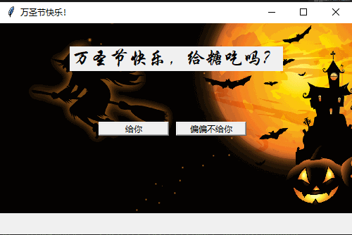
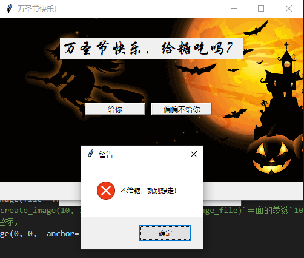
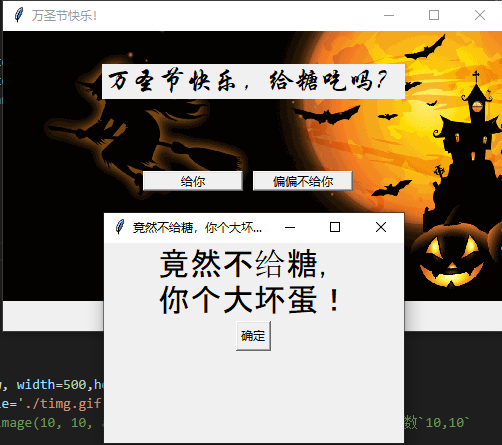
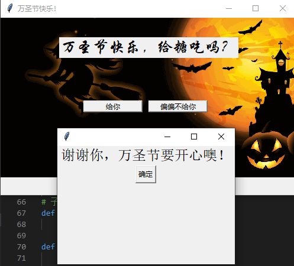

# 搞怪万圣节

在每年的10月31日，便是万圣节，在这里小编祝大家万圣节快乐！
万圣节是西方世界的传统节日，其主题是鬼怪、吓人，以及与死亡、魔法、怪物有关的事物。通常与万圣夜扯上关系的事物有南瓜、鬼魂、食尸鬼、女巫、蝙蝠、黑猫、猫头鹰、精灵、僵尸、骷髅和恶魔等，还有虚构人物如吸血鬼和科学怪人。当晚小孩会穿上化妆服，戴上面具，挨家挨户收集糖果。 流传着“**不给糖就捣蛋**”的习俗。

<span><div style="text-align: center;">

</div></span>

今天小编就带大家制作一款搞怪软件，利用tkinter和pyttsx3库实现简单的搞怪程序，大家快学起来吧。

## 01 pyttsx3介绍
pyttsx3是Python中的文本到语音转换库，可在本地工作。

### a 安装
安装步骤十分简单，使用pip命令即可：
```python
pip install pyttsx3
```
### b 特点
- 完全离线的文本到语音转换模块
- 播放速度可调整
- 播放音量可调整
- 可对声音进行选择
- 可以将音频保存在本地
- 简单强大直观

### c 使用方法
基础使用播放语音
```python
import pyttsx3
pyttsx3.speak("I will speak this text")

```
对声音进行设置播放
```python
import pyttsx3
# 创建对象
engine = pyttsx3.init() 
""" 语速"""
# 获取当前语速
rate = engine.getProperty('rate')  
# 设置语速                    
engine.setProperty('rate', 125)     

"""音量"""
# 获取当前音量（在0到1之间）
volume = engine.getProperty('volume')   
# 设置音量（在0到1之间）
engine.setProperty('volume',1.0)    

"""声音选择"""
# 获取当前声音
voices = engine.getProperty('voices')  
# 设置为男声     
#engine.setProperty('voice', voices[0].id)  
# 设置为女声 
engine.setProperty('voice', voices[1].id)   

"""声音播放"""
engine.say("Hello World!")
engine.say('My current speaking rate is ' + str(rate))
engine.runAndWait()
engine.stop()

"""保存声音"""
engine.save_to_file('Hello World', 'test.mp3')
engine.runAndWait()
```
由上面的程序可以对不同声音的处理方式，详细使用方法可见官方文档https://pyttsx3.readthedocs.io/en/latest/，小编就不在这里详细介绍了，对于tkinter的使用，之前很多文章都介绍过了，小编也不赘述了，下面将对搞怪程序进行设计。
## 02 搞怪程序设计
### a 整体设计思路
以万圣节为背景，以万圣节中**不给糖就捣蛋**”的习俗，设计捣蛋界面，直到收到糖果为止。
整个设计以tkinter为基础，在用户不给糖的情况，分别用声音和弹窗进行捣蛋，迫使用户赠送糖果。
### b 整体界面设计
搞怪软件的界面如下，包含了祝福语标签和按键标签，下面小编将对其实现原理进行解析。
<span><div style="text-align: center;">

</div></span>

```python
window = tk.Tk()
# 设置主窗口大小
window.geometry('500x300')
# 设置主窗口标题
window.title('万圣节快乐！')


## 主界面设计
canvas = tk.Canvas(window, width=500,height=300,bd=0, highlightthickness=0)
## 图片只能加载gif格式
photo = tk.PhotoImage(file='./timg.gif')
# 参数 0, 0为放置坐标，anchor='nw'为以坐上角为基准
canvas.create_image(0, 0,  anchor='nw',image=photo)
canvas.pack()

lable1 = tk.Label(window, text="万圣节快乐，给糖吃吗？",font=("华文行楷",20))
# 设置按钮
btn1 = tk.Button(window, text="给你")
btn2 = tk.Button(window, text="偏偏不给你")
btn1.config(command=Yes)
btn2.config(command=No)

canvas.create_window(250, 50,window=lable1)
canvas.create_window(190, 150, width=100, height=20,window=btn1)
canvas.create_window(300, 150, width=100, height=20,window=btn2)
```
在设计中，小编遇到了一些困难，同时将标签和按键放在背景图上，如果以主界面window为载体，他们的分布会相互影响，经过资料查询，小编以画布canvas作为载体，通过操作canvas.create_window指定label和button的位置和大小，成功的实现了在背景图片添加label和button的目的，显示效果如上图。

## c 按键函数的设计
为了实现只有给糖操作才能实现退出界面的效果，对不同的按键进行不同的函数设计，并使用串口和语音显示和播放不同的搞怪信息，搞怪信息由初始化中longtext定义，通过随机数进行随机获取，详细代码如下：
```python
# 按键内容设计
longtext = ["不给糖，就别想走！","竟然不给糖，\n你个大坏蛋！","不给糖就搞怪,哼！"]
# print(longtext[random.randint(0,len(longtext)-1)])
def closeWindow():
    engine = pyttsx3.init()
    texts=longtext[random.randint(0,len(longtext)-1)]
    engine.say(texts)
    engine.runAndWait()
    tkinter.messagebox.showerror(title="警告",message =texts )
    
    return

window.protocol('WM_DELETE_WINDOW', closeWindow)
# 点击给糖的操作
def Yes():
    yes = tk.Toplevel(window)
    yes.geometry('300x200')
    yes.title("")

    text1 = "谢谢你，万圣节要开心噢！"

    engine = pyttsx3.init()
    engine.say(text1)
    engine.runAndWait()

    lable = tk.Label(yes,text=text1, font=("Arial", 18))
    btn = tk.Button(yes, text="确定")
    btn.config(command=lambda :closeyes(yes))
    lable.pack()

    yes.protocol('WM_DELETE_WINDOW', closeall)
    btn.pack()

# 点击不给糖的操作
def No():
    no = tk.Toplevel(window)
    no.geometry('300x200')

    text1 = longtext[random.randint(0,len(longtext)-1)]
    #"再考虑考虑呗"
    engine = pyttsx3.init()
    engine.say(text1)
    engine.runAndWait()

    no.title(text1)
    lable = tk.Label(no,text=text1, font=("Arial", 24))
    btn = tk.Button(no, text="确定")
    btn.config(command=lambda :closeno(no))
    lable.pack()
    btn.pack()
# 子窗口关闭操作
def closeall():
    window.destroy()

def closeyes(yes):
    window.destroy()
    yes.destroy()

def closeno(no):
    no.destroy()

```
对于主界面的窗口关闭操作是不可行的，这里定义了closeWindow函数，弹出警告窗口，内容从longtext中随机选取。
<span><div style="text-align: center;">

</div></span>

在按键“偏偏不给糖”中，通过yes = tk.Toplevel(window)，yes.geometry('300x200')创建弹出窗口，并在上面设置图标和按键，并指定子窗口按键的函数closeno，退出子窗口，并在其中加入语音模块pyttsx3，发出相应的声音，显示界面如下所示：

<span><div style="text-align: center;">

</div></span>

在按键“给你”中，与按键“偏偏不给糖”定义相似，使用语音模块和label在子窗口显示，但在子按键绑定中绑定closeyes函数，会同时退出子窗口和主窗口，如果用户点击了关闭子窗口未点击确定，会通过closeall关闭主窗口。
<span><div style="text-align: center;">

</div></span>
通过上面的设计便达到了搞怪的目的，只有在给糖的情况下进行退出。

小编在这里祝大家万圣节快乐！多多点赞噢！不然小编也到捣蛋了！


***
到这里小编的搞怪程序就结束了，大家想不想亲自体验呢，快在公众号中回复“”获取吧。