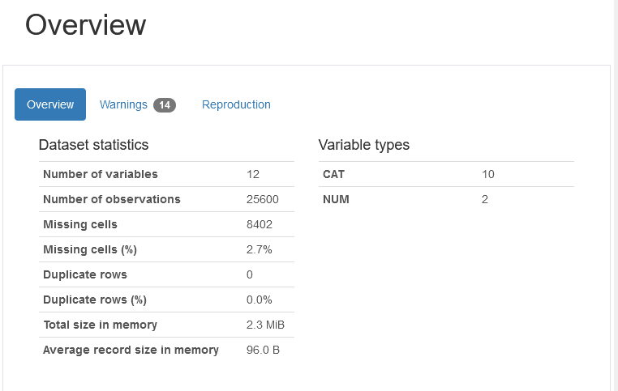

# 使用Pandas Profiling分析秋天的第一杯咖啡

这几日 **秋天的第一杯奶茶** 火速登上微博和知乎热搜榜第一，不知道大家给女朋友送奶茶了吗，反正小编是送了的（保命要紧）。然而对于小编来说，奶茶的并不是日常刚需，咖啡才是日常加班的绝配，今天小编就带大家学习一个github上的开源库------Pandas Profiling，用这个库带大家分析下kaggle上的星巴克数据，看看咖啡在大家眼中的评价，开启 **秋天的第一杯咖啡**。

## 01 Pandas Profiling
今天小编介绍的这个库是基于pandas库的延伸，名字叫做Pandas Profiling，其可以实现对数据的总体快速分析，并以图表的方式展现出来，对于做数据分析的人来说，绝对是一个福利，只用 **一行命令**就可以进行对数据的整体分析，可以节省大量的时间。
关于这个库的安装，只需要使用下面命令即可,他会自动更新安装所需要的库。
```
pip install pandas-profiling[notebook]
```

## 02 星巴克的数据集
今天小编选取的数据集是kaggle上的星巴克数据集，该数据集包含截至2017年2月当前运营的每个星巴克或子公司商店位置的记录，原始数据展示如下：

有表中可以看出，该数据集拥有13个维度，依次包含：
Brand(品牌)
Store Number(店铺号)
Store Name(店铺名字)
Ownership Type(所有权类型)
StreetAddress(街道地址)
City(店铺所在城市)
State/Province(店铺所在州，省份)
Country(店铺所在国家)
ostcode(邮编)
PhoneNumber(电话号码)
Timezone(时区)
Longitude(经度)
Latitude(维度)
如果大家对这个数据集有兴趣的话，可以在官方链接进行下载：
https://www.kaggle.com/starbucks/store-locations

## 03 使用Pandas Profiling对其进行数据分析
### 1）Pandas Profiling的使用
a.其使用方法极其简单，小编这就为大家进行展示,首先是所需库的导入。
```python
import numpy as np
import pandas as pd
from pandas_profiling import ProfileReport
```
b.第二步是数据的读取，使用pandas读取即可：
```python
df1 = pd.read_csv("directory.csv",usecols=[1,2,3,4,5,6,7,8,9,10,11,12])
```
c.分析图表的生成
官方建议使用notebook使用，可以在notebook中直接显示生成的报告，也可以生成为html文件。
```python
profile = ProfileReport(df1, title="Pandas Profiling Report",minimal=False)
profile.to_notebook_iframe()
```
此外，在进行分析时，可选参数minimal=True,默认为True，表明使用简要分析，这里小编选用的False，尽可能的对数据进行最大化分析。
### 2）生成图表的分析
其生成的图表中包含了Overview、Variables、Interaction、Correlations、Missing values、Sample六个部分，下面将对每个部分进行简要分析。
a. Overview(整体浏览)

由表中可以看出数据的维度（这里小编没有读取第一维Brand，所以只有12维），缺失值占比、变量类型等总体情况，可以对数据有一个整体把握。

b. Variables(变量分析)

该部分会对每一个变量进行统计，包含总量，缺失值等，以及会显示改变量中排名靠前的数据，可以通过Toggle details展示详细信息，下面对Country这个数据展开显示，由图表可以看出其展现了星巴克所在最多的几个国家及其占比。


对于数值变量，其会展示更多的信息，常用的统计变量：最大值、最小值、均值、标准差、方差等均会显示，以Longitude为例，如下图所示。


c. Interaction(相互作用分析)
该系统会对数值信息进行相互作用的分析，可由读者自己选取自变量和因变量进行可视化分析，选取有用的数据。这里因为只有经纬度为数值数据，所以只有两个选项，小编选用Longitude作为横坐标，Latitude作为纵坐标，下图显示了Longitude随Latitude的变化关系。


d. Correlations(相关性分析)
相关分析包含了五个指标：皮尔逊相关系数、Spearman秩相关系数、Kendall等级相关系数、Phik（φk）相关系数、Cramér's V（名义随机变量的关联度量），点击Toggle correlation descriptions 可以看到对各个系数的解释，用户可以根据需求选择相应的指标。     
下图显示的Phik（φk）相关系数，颜色越深表明相关性越大，可以看出，每个变量和自身相关性为1，完全相关，此外，可以看出经纬度和国家的相关性很高，在选取变量时，可将相关性很高的变量合并为一个变量进行分析，降低变量的维数。


e. Missing values(缺失值)
这个部分是对数据中的缺失值进行统计，并以图表显示相关数据。由图表可以看出Street Adress、city、Postcode、Phone Number、Longitude、Latitude 等变量出现了缺失值，一目了然。


f. Sample(示例)
最后时原始数据的显示，显示最前面和最后面的数据，方便使用者边观察数据边进行分析。


基于以上分析，大家可以清楚看到Pandas Profiling带来的便利。通过Overview部分对整体数据先进行一定的把握，如果想要具体分析某个特征，则可以通过Variables进行详细查看，对于变量之间的关系呢，通过Interaction和Correlations又可以进行分析，简直就是个神器！在星巴克的数据集中，通过分析，我们从总体可以看出国家和经纬度的相关关系，星巴克在美国的占有量最多，我国占有排名第二等初步消息，十分便利。

***
小编对于Pandas Profiling库的分析到这里就基本结束了。但是随着机器学习数据集中数据量的增加，该模块的计算也将耗费极大的资源，当数据量较大时，可以选择minimal=True 的模式，进行快速计算，但会损失一定的数据分析结果。
大家对这个库满意吗，小编是十分满意的，可以极大的减少自己对数据初步分析的时间了，大家快用起来吧。

链接：https://github.com/pandas-profiling/pandas-profiling