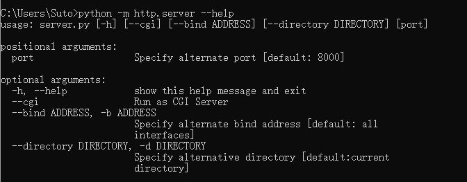
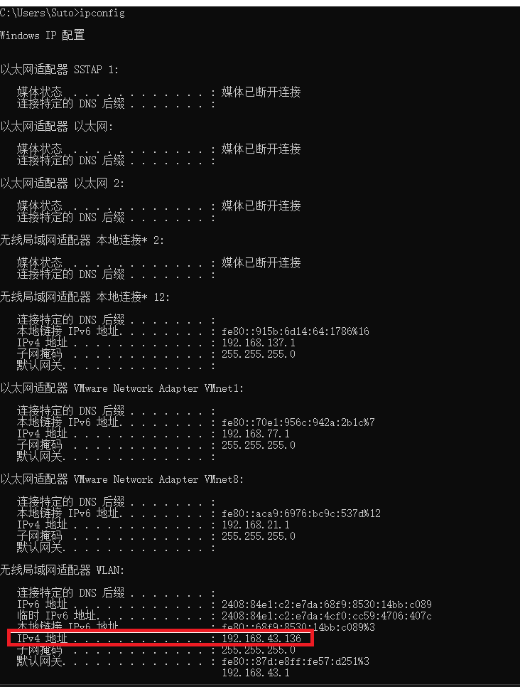
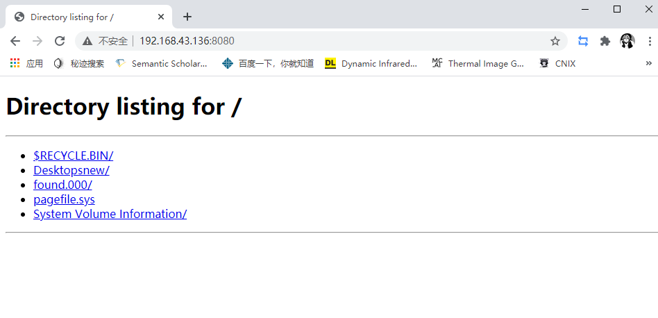
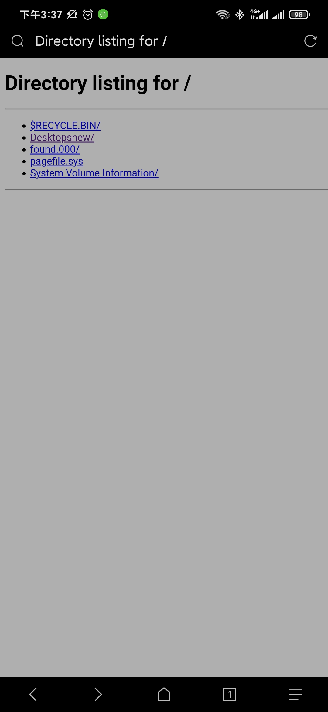
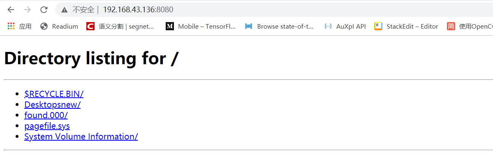
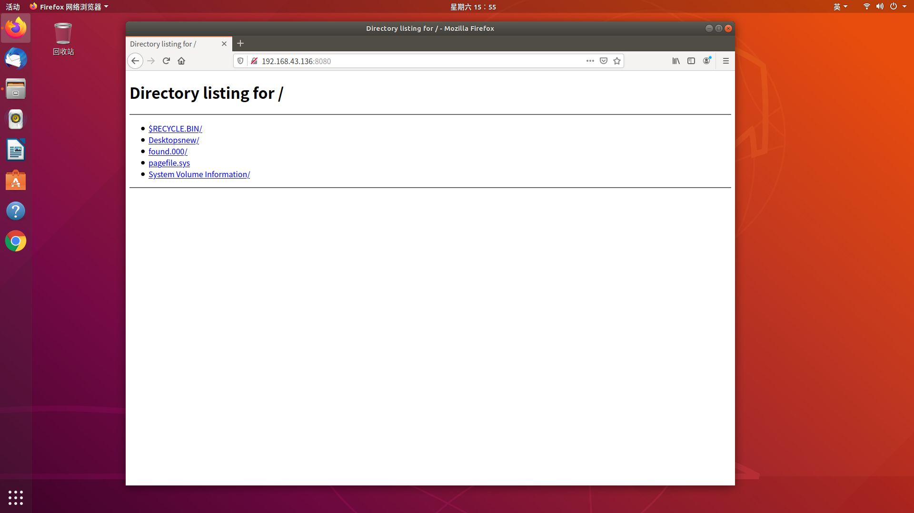
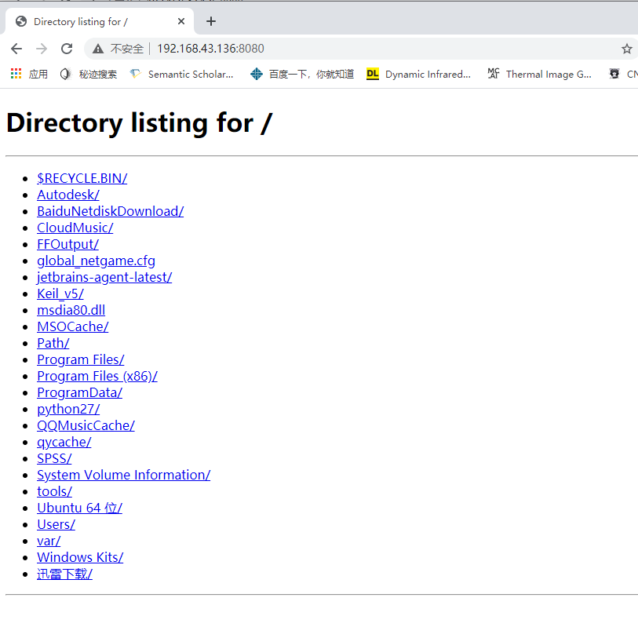

# python小技巧：利用http.server迅速搭建局域网服务器
不知道大家有没有遇到过这样的情况，在做项目或者研发的时候，迫切想要将一个文件传输给另一台电脑，却找不到U盘，于是麻烦的通过登陆qq、微信等社交软件，或者邮箱等工具进行传输，十分麻烦，让人苦恼，今天小编就给大家提供一种简单的方式来解决这一问题，通过调用python中的http.server搭建局域网服务器，让这个问题变得简单。

## 01 什么是无线局域网

无线局域网是计算机网络与无线通信技术相结合的产物。通俗点说，无线局域网（Wireless local－area network，WLAN）就是在不采用传统电缆线的同时，提供传统有线局域网的所有功能，网络所需的基础设施不需要再埋在地下或隐藏在墙里，网络却能够随着实际需要移动或变化。之所以还称其是局域网，是因为会受到无线连接设备与电脑之间距离的远近限制而影响传输范围，所以必须要在区域范围之内才可以连上网路。
简单的说，就是多个设备连接在同一个网段，共享一个网络，就可以组成为局域网。

## 02 什么是服务器
服务器（server）就是提供服务的机器，比如文件服务、WEB服务、应用程序服务、域名服务等。每一个服务器都有个IP地址。我们通过http协议访问时，一般是输入域名，域名通过dns解析服务，转换成IP。
关于HTTP服务器，我们知道浏览器是http(s)的客户端，目的是连接远程的http服务器,然后服务器返回浏览器数据。浏览器接收数据解析数据之后展现出来，我们看到的外在表现就是，浏览器访问一个url，然后就得到相应的web页面。今天，小编要实现的便是一个HTTP服务器，使用python内置的http.server函数，达到文件传输的目的。

## 03 http.server内置函数介绍
Python的官方手册介绍，HTTPServer 是 socketserver.TCPServer 的一个子类。它会创建和侦听 HTTP 套接字，并将请求调度给处理程序。
在python3.7中，http.server提供了5种参数，调用下面帮助命令可显示如下。
```
python -m http.server --help
```

由上图可以看出，其包含位置参数和可选参数。
- 位置参数
**port**  ——是指HTTP服务器所指定的端口，默认为8000
- 可选参数
**-h/--help** ——用来获取帮助信息
**--cgi** ——服务器为CGI模式
**--bind/-b  ADDRESS** ——绑定ip地址,ADDRESS为ip地址
**--directory/-d  DIRECTORY** ——指定目录，默认为当前目录（即为命令行运行的目录），简单地说，就是当前服务器可以提供被访问的目录
## 04 搭建本地局域网服务器
搭建本地服务器的代码十分简单，只需要在命令行运行以下代码即可。
```
python -m http.server 8080
```
上面的代码用来启动http服务器，默认IP是电脑本地无线IPv4网络，默认目录为命令行运行的目录，如果想要改变参数，调用03种的可变参数即可。
原理的讲解到这里就结束了，接下来边是实践，小编使用自己手机的热点，在ubuntu，windows以及移动端进行了测试。
- 首先要获取本地的ip，windows种可以通过ipconfig（ubuntu种通过ifconfig -a）获取IP,注意选用的是无线局域网适配器WLAN中的IPv4地址。

- 根据所得的ip和端口，在浏览器输入http://192.168.43.136:8080/ 访问服务器即可。下面展示在本机，移动端，其他机型win和ubuntu执行的结果。

<span><div style="text-align: center;">
本机

</div></span>  
<span><div style="text-align: center;">
移动端


</div></span>  

<span><div style="text-align: center;">
其他机型windows


</div></span>  
<span><div style="text-align: center;">
其他机型ubuntu  


</div></span>  

对于改变文件目录，小编改为D盘为可访问盘，命令如下，其他参数使用方法类似。
```
python -m http.server 8080 -d d:
```
可以看到被访问的目录发生改变。
<span><div style="text-align: center;">

</div></span> 

***
对于使用http.server搭建服务器的相关概念和实践到这里就结束了，使用这个python自带的小功能，便可以极为快速的搭建一个简单的http服务器，使得局域网内的设备都可以进行访问，是不是很方便呢，大家快用起来吧。