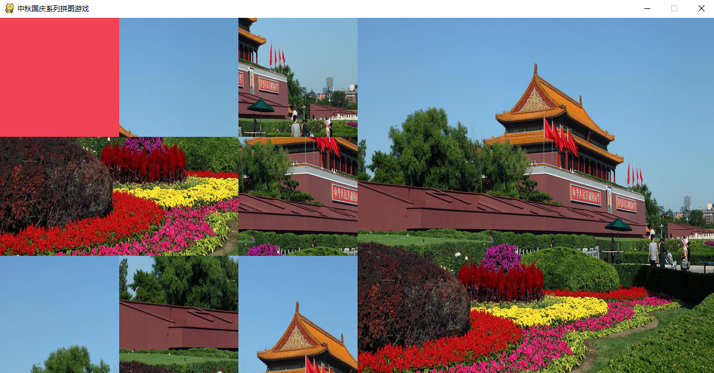
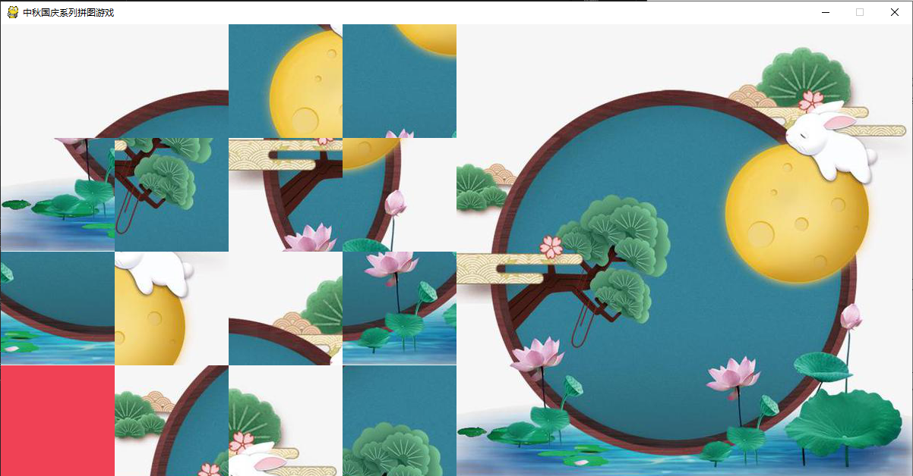
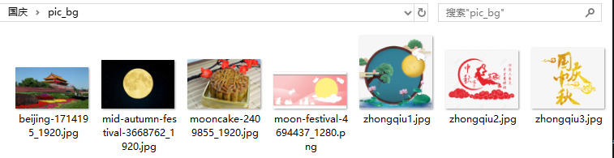

# 中秋国庆拼图特辑
一年一度的国庆佳节来了，大家是不是早已压抑不住自己的心情，迫不及待的想要去玩了，反正小编是这样的。随着国庆的到来，中秋佳节也随之而来，正巧的是，今年的国庆当天便是中秋节，在这个合家欢乐的日子，不知道大家有没与家人团聚，小编不幸的没有买到票，不管相聚与否，希望大家都开心快乐，在这里小编祝大家国庆玩的开心，中秋过的快乐！


今天小编要介绍的呢，就是以中秋国庆佳节为背景的python拼图小游戏，利用搜集好的中秋国庆系列图片作为背景，进行拼图，映衬节日的氛围，整体的展示画面如下图所示，其中朱红色为空白区域，通过对空白区域的移动，完成对图片的还原。


## 01 整个游戏设计思路
### a.所需要的开发库
为了实现这一功能，小编查询了大量的资料，对游戏进行了人性化的定制，可以根据自己的喜好设置游戏难度（选择拼图的阶数），选择游戏的背景，只需要改动参数初始化便可以实现。这个游戏所需要的库有哪些呢，小编对在这里列举，方便大家使用。
```
random   -----随机数
pygame   -----python游戏库
copy     -----复制的库
PIL      -----图像处理的库 
os       -----系统库
```

### b.游戏的设计思路
#### 1）绘制画布
- 使用的pygame中的pygame.display.set_mode((1200, 600))函数设置背景板，根据需求计算背景板大小。
- 通过计算划分界面个部分的位置，拼图区域与原图区域。

#### 2）绘图实现
- 通过pygame.mouse.get_pos() 获取鼠标位置进行交互。
- 使用设计好的拼图算法（后面有详细介绍）进行位置检测，确定是否交换位置。
- 使用pygame.display.flip()刷新界面。
#### 3）个性化设计
- 玩家可根据自己需求输入num为游戏难度（拼图阶数）。
- 玩家可根据喜好设置系列背景，程序会从指定文件夹随机选择。


## 02 编程实现
针对上面的游戏设计，小编将从游戏页面设计、图片加载设计、算法实现等三个方面进行程序讲解。

### a.游戏页面设计
对于游戏的页面设计，包含了整体的页面设计和部分的页面设计，小编通过pygame中的函数将页面大小设计为1200*600，旨在将页面分为两个部分，左半部分为拼图区域，右半部分展示原图（下图为4阶拼图）。

```python
#  初始化
# 图片路径
path = "G:/Desktopsnew/小编/国庆/pic_bg"
# 请输入阶数
num = input("请输入阶数")
while(pic_size % (int(num) )!= 0):
    num = input("输入阶数不符合，请重新输入")

# 参数初始化
pic_size = 600  # 图片大小
pic_fenge = int(num)   # 阶数
pix_fenge = pic_size /pic_fenge   # 每个块的像素大小
pic_huidu = pic_fenge * pic_fenge - 1  # 空白图像位置

pygame.init()
# 窗口标题screen
pygame.display.set_caption('中秋国庆系列拼图游戏')
# 窗口大小
screen = pygame.display.set_mode((1200, 600))
```

对于拼图难度个性化设计，通过参数num获取输入的阶数。
对于图片系列个性化设计，只需要将path路径给为自己准备的图片即可。
```python
#   地图初始化
#  其中  init_Map  表示初始化的地图 之后会被打乱
#   end_map 是正确分布的地图
init_Map = []

for i in range(pic_fenge):
    b = []
    for j in range(pic_fenge):
        b.append(i*pic_fenge+j)
    init_Map.append(b)

end_Map = copy.deepcopy(init_Map) 
```
地图初始化中，将地图绘制为 num* num 的集合（num为阶数），通过list添加为两层数据使得数组为num*num的大小，最后一个数值代表空白区域。


```python
#背景色填充成 朱红色
    screen.fill((240,65,85))
    #绘图
    for y in range(pic_fenge):
        for x in range(pic_fenge):
            i = init_Map[y][x]
            if i == pic_huidu:      #空白图块不用绘制
                continue
            dx = (i % pic_fenge) * pix_fenge      #计算绘图偏移量
            dy = (int(i / pic_fenge)) * pix_fenge
            screen.blit(img, (x * pix_fenge, y * pix_fenge), (dx, dy, pix_fenge, pix_fenge))
    # 画参考图片
    screen.blit(img, (600, 0))
```
对于拼图部分和原图部分进行分别绘制，根据获取的地图位置，绘制相对应部分的图片。首先计算出每个块的像素值大小pix_fenge = pic_size /pic_fenge，根据地图数组中的元素位置（x,y）选取原图中对应位置进行绘制，对于空白块，不进行绘制。

### b.图片加载设计
小编这里选择的是中秋国庆主题（如果需要的话，大家可以替换为任意主题，比如女朋友的照片等），采用随机选取图片的方式，读取实现存放好的照片，如下图所示。

有了图片素材，接下来就是对素材的预处理了，这里小编使用os.walk对目标文件夹进行遍历，获取图片序列fileses，并使用randint随机选取一张图片左为背景图片，之后通过PIL库读取图像并resize为600*600（注意：某些图像尺寸相差太大，resize之后会变得很变扭，大家视情况而定），保存为临时文件temp.jpg供pyganme调用。
```python
## 获取图片片目录
def file_name(file_dir):
    roots = []
    dirses = []
    fileses = []
    for root, dirs, files in os.walk(file_dir):
        roots.append(root)
        dirses.append(dirs)
        fileses.append(files)
    return roots,dirses,fileses
roots,dirses,fileses = file_name(path)

#   序列长度  print(fileses[0])
# 获取图像序列长度list 进行随机选择
ran = randint(0,len(fileses[0])-1)

# 图片路径
pic_path = os.path.join(path,fileses[0][ran])

# 对图片进行 resize
img = Image.open(pic_path)
# img.show()

image_size = img.resize((600, 600),Image.ANTIALIAS)
image_size.save("temp.jpg")

```

### c.算法实现
对于拼图游戏的关键，在于其中的算法，主要思想是检测被点击的图像的位置，根据位置判断被点击的图像是否位于空白图像四周，如果位于，则进行图片互换，否则不进行，具体实现如下所示。
```python
#游戏的单击事件
# y行   x 列
def click(x, y, map):
    # 如果点击了空白  下面的图片 上下图片互换
    if y - 1 >= 0 and map[y - 1][x] == pic_huidu:
        map[y][x], map[y - 1][x] = map[y - 1][x], map[y][x]
    # 如果点击了空白  上面的图片 上下图片互换    
    elif y + 1 <= pic_fenge-1 and map[y + 1][x] == pic_huidu:
        map[y][x], map[y + 1][x] = map[y + 1][x], map[y][x]
    # 如果点击了空白  右面的图片 左右图片互换      
    elif x - 1 >= 0 and map[y][x - 1] == pic_huidu:
        map[y][x], map[y][x - 1] = map[y][x - 1], map[y][x]
    # 如果点击了空白  左面的图片 左右图片互换   
    elif x + 1 <= pic_fenge-1 and map[y][x + 1] == pic_huidu:
        map[y][x], map[y][x + 1] = map[y][x + 1], map[y][x]
```
这里地图数组的初始化使用拼图的方式，随机进行1000次的移动，作为初始化的init_map，如果使用随机打乱数组，则有可能无法恢复。                                  
```python
#  采用 点击的方式打乱地图
def randMap(map):
    for i in range(1000):
        x = random.randint(0, pic_fenge-1 )
        y = random.randint(0, pic_fenge-1 )
        click(x, y, map)
```


对于整个游戏的设计基本介绍完毕了，只需要通过主函数将各部分组合就好了，大家如果想要源代码进行学习玩耍的话，只需要在后台回复"关键词"即可。下图是小编进行的测试，演示过程包含了窗口和命令行两部分。


***
对于整个拼图拼图游戏，小编设置了人性化的互动，大家可以根据根据自己的要求设计阶数进行尝试，并设置自己喜欢的背景，希望大家能够喜欢。
