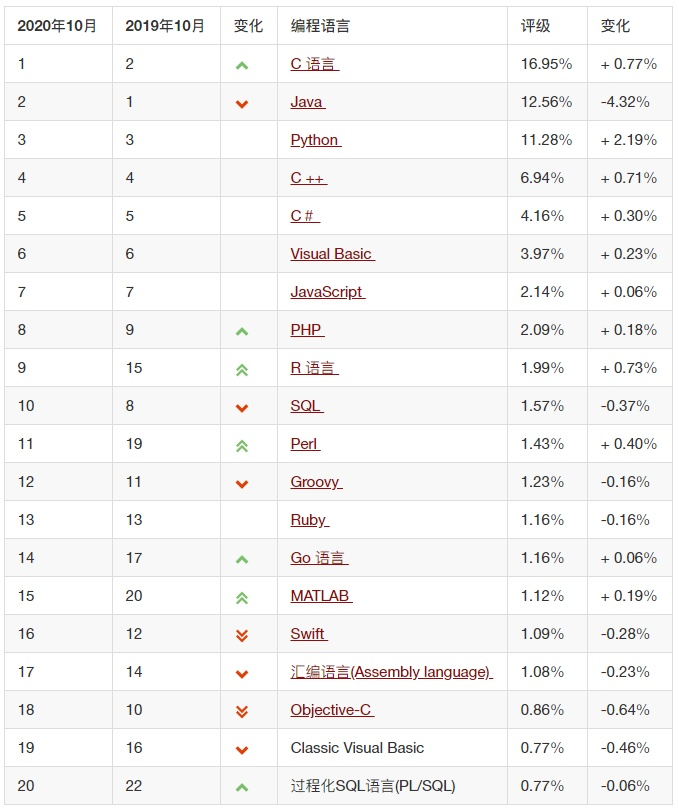
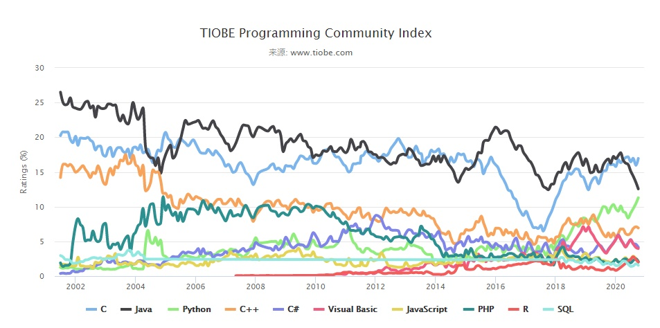
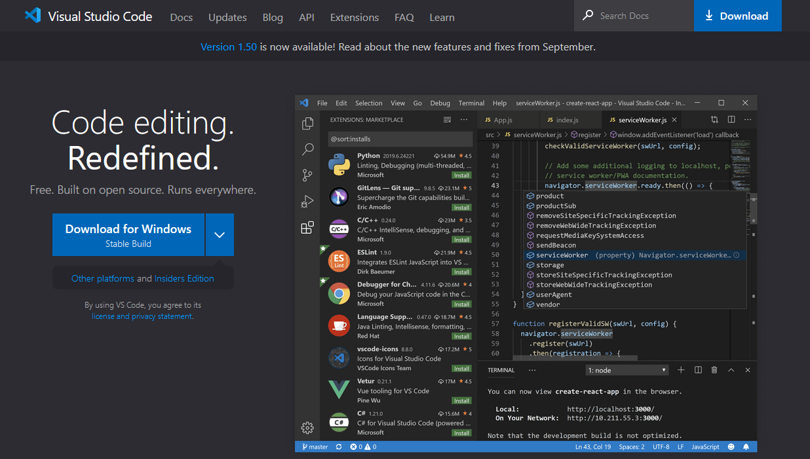
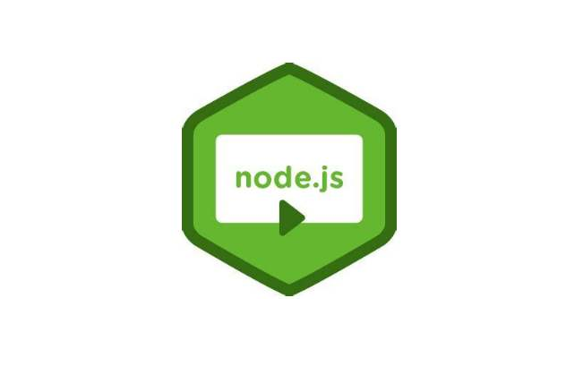
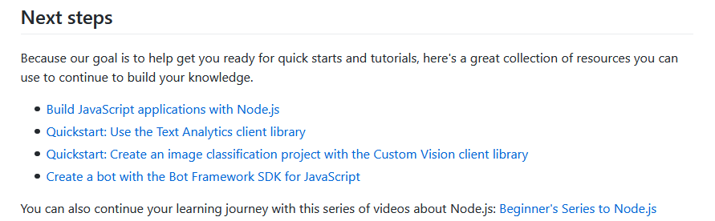
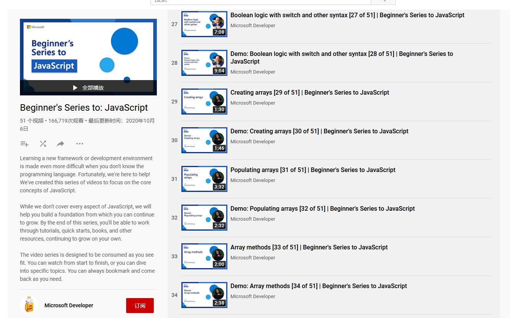

# 微软推出JS教程了！
对于大家这种编程好手来说，JavaScript一定不回陌生，他常处于十大常用编程语言之列，受到广大编程爱好者的欢迎，据 TIOBE 统计，截至2020年10月，JavaScript再编程语言中排行在第七位，评级也在稳固提升。

在TIOBE过去十多年的统计中，我们可以看到JavaScript的基本地位保持不变，一直处于前十的位置，说明其受欢迎程度和不可替代性，尚未出现新的语言可以替代JavaScript，将他挤下神坛，他在地位仍牢牢不可撼动。

在去年9月份微软推出python教程之后，在今年10月又推出了JavaScript学习教程，为广大JavaScript初学者指明了方向。下面就由小编和大家一起探索一下这个教程吧。
## 01 JavaScript语言介绍
在维基百科中，我们可以看到其定义为：JavaScript（通常缩写为JS）是一种高级的、解释型的编程语言。JavaScript是一门基于原型、函数先行的语言，是一门多范式的语言，它支持面向对象程序设计，命令式编程，以及函数式编程。它提供语法来操控文本、数组、日期以及正则表达式等，不支持I/O，比如网络、存储和图形等，但这些都可以由它的宿主环境提供支持。它已经由ECMA（欧洲电脑制造商协会）通过ECMAScript实现语言的标准化。它被世界上的绝大多数网站所使用，也被世界主流浏览器（Chrome、IE、Firefox、Safari、Opera）支持。

大家都知道前端中三大语言HTML、CSS、JavaScript，他们分别有自己的分工，JavaScript是其中非常重要的一环。
- HTML：它是整个网站的骨架。
- CSS： 它是对整个网站骨架的内容进行美化（修饰）
- JavaScript： 它能够让整个页面具有动态效果
## 02 微软高级项目经理对JS的评价
微软高级项目经理克里斯托弗·哈里森在这门课程开头写道：

有一句很流行的话是这样说的："**任何可以用JavaScript编写的应用程序最终都会用JavaScript编写。**" 这句话被称为阿特伍德定律，它强调了该语言的灵活性。JavaScript已经无处不在，而且它的受欢迎程度还在不断提高。

由上面的话可以看到JavaScript的受欢迎程度。同时克里斯托弗·哈里森还提到了JavaScript的一些应用：

**众多的框架、SDK和API**都是建立在JavaScript基础上的。Azure Cognitive Services和Azure Bot Framework等服务也提供了JavaScript实现，让你可以将**人工智能**融入到你的应用中。

从微软高级项目经理克里斯托弗·哈里森的评价中，我们可以看到其对JS的高度赞赏，进一步说明了JS的受欢迎程度。

## 03 教程介绍
微软推出的教程总共包含了51节课程，主要包含了JavaScript使用所需的必要知识，只是一个**入门级**的教程，如果大家学完之后想要继续提升的话，还需要更加努力哦。接下来小编就带大家一起探索这个课程。

### a 使用的ide与环境
在整个课程中，使用**Visual Studio Code**设置开发环境，并安装**Node.js**对JavaScript进行编译运行。
- Visual Studio Code

Visual Studio Code是一个由微软开发，同时支持Windows 、 Linux和macOS等操作系统的免费代码编辑器，它支持测试，并内置了Git 版本控制功能，同时也具有开发环境功能，例如代码补全、代码片段和代码重构等。该编辑器支持用户个性化配置，例如改变主题颜色、键盘快捷方式等各种属性和参数，同时还在编辑器中内置了扩展程序管理的功能。同时支持多种语言：Java、Pyhton、C++、JavaScript、C#等等。该编辑器自推出以来受到了开发者的广大欢迎，小编也是其中的一份子，不知道大家有没有在使用呢，小编良心推荐。

- Node.js

node.js 是一个基于 Chrome V8 引擎的 JavaScirpt 运行环境。它让javascript可以开发后端程序，实现几乎其他后端语言实现的所有功能，可以与PHP、Java、Python、.NET、Ruby等后端语言平起平坐。
### b 教程概要
首先整个教程先介绍了软件包的安装，帮助使用者搭建相应环境，然后搭建“Hello World”项目作为入门的第一课，然后扩展到语法、对象、异步功能的编程，逐渐深入的进行介绍，是入门的极佳教程。
参考官方的项目笔记仓库（https://github.com/microsoft/beginners-intro-javascript-node）
小编对所学内容进行了总结，主要包含以下方面：
- 工具包的安装
- 编写第一个JS程序（Hello World）
- 注释
- 变量
- 字符串
- JS数据类型
- 数学运算
- 异常处理
- Date对象
- 条件语句
- 数组
- 循环语句
- 函数/方法定义
- 匿名函数
- 复杂数据类型
- 异步
- 包/模块

当然上面只是JS的基础使用，想要进行提高，在学完教程后，官方给出了四个可以提升技能的项目链接，一条龙服务到位。

感兴趣的同学可以在官方笔记找到链接进行学习。
### c 教程链接
其官方链接如下，但是需要科学上网才能进行网站访问。
https://aka.ms/learnJS

对于不能科学上网的小伙伴们，是不是很可惜呢。大家其实不用担心了，早就有人对教程进行了搬运，在B站中搜索微软JavaScript就可看到许多搬运教程，其中鱼C-小甲鱼已经对课程进行了部分翻译，翻译仍在继续，需要的伙伴们可以前往查看，链接如下：
https://www.bilibili.com/video/BV18a4y1L7kD?from=search&seid=5452303311094384709

***
到这里，小编的探索就结束了，对JS感兴趣的同学赶快学起来吧！