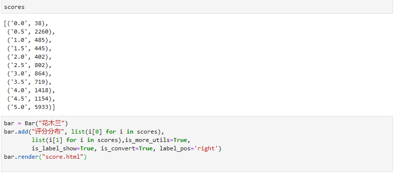
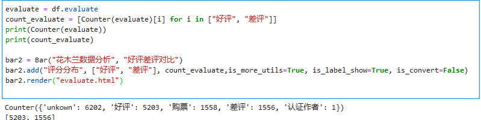

# 用Python对花木兰进行数据分析，用不一样的视角观影

随着疫情的可控，电影院也于7月20日有序恢复，各大电影开始纷纷上映，其中由 **刘亦菲、甄子丹** 领衔主演的迪斯尼真人版剧情电影 **《花木兰》** 也带着一股巨浪向人们袭来，这部从拍摄之初就饱受争议的电影，究竟会带给人们怎样的视觉体验，让人备受期待。从9月11日上映到现在也有9天了，相信大家也前往电影院进行了观看。
在这里，小编由于好奇心的缘故，在猫眼上爬取上万条的用户评价，对其进行数据分析，今天就和大家一起对其进行探索。

   
## 01 数据爬取

经过小编查询资料，发现猫眼电影有一个公开的api可以从中获取猫眼的电影评论数据，并且数据提供的格式json格式，方便操作。这个接口如下：

http://m.maoyan.com/mmdb/comments/movie/movieid.json?_v_=yes&offset=15&startTime=2019-08-04%2018:18:53

 

这个接口主要有两个参数，movieid和startTime，其中movieid是指猫眼中每个电影独有的id，如《花木兰》的movieid=1210778；startTime是指该页面中第一条评论的时间，在这个页面，每页共有15条评论，其是时间依次递减的，每次爬取一页之后将startime改为最后一个影评的starttime即可爬取下一页的影评。

  

   
有了这个接口，就可以很快的对影评进行爬取了,这里依赖于requests、json等库进行，获取相关信息，相关代码如下所示。

小编先带大家看看爬的的原始数据，主要包含了发表者的城市坐标、评论内容，性别，用户等级以及好评度等信息。

   

**注意** ：猫眼网站设置了反爬机制，小编建议大家先在浏览器中打开页面，确保能打开后，将浏览器中headers中的User-Agent设为爬虫中的User-Agent，这样可以保证爬取的正常，但是当超过一定时间之后，该接口也会被限制，需要更换，目前小编还没有找到更好的解决办法，如果大家有好的方法，可以在评论区留言噢。

## 02 数据分析
有了原始数据，剩下的就是对数据的整合分析了，这里选用pyecharts库进行数据分析，在公众号之前的文章中讲过它的用法，有兴趣的小伙伴可以回去看看哦。
### 1)整体分析
首先查看一下大家对花木兰电影的总体评分吧!

由图表可以看出，大家对花木兰的评价分布还是比较均衡的，也有一点两极分化的趋势，给予高分和低分的的人都比较多，据小编对评论的阅读和观影的体验，自身认为两级分化是有原因的。其迪斯尼的制作特效，以及刘亦菲的超高人气，为其吸引了大量人气，带来了一波好评；但是对于熟知中国古典故事花木兰剧情的人来说，其剧情的设计是让人很难接受的，也就导致了国人的诸多差评。

### 2)词云分析
基于评价两级分化的现象，小编决定探究一下两级分化的原因究竟是什么，这里小编对整体评价、好评、坏评的词云分别进行绘制，绘制得到的结果如下图所示。

由整体评价词云可以看出，整体的评价还是偏向好的一方面，大大的 **“好看”** 两字写在了词云中央；在好评词云中，可以看到 **“刘亦菲”、“就是好看”** 等词语，表现出给予好评的观众中比较看重自身观影的感受，当然，亦菲仙女也为其吸引力巨大的流量；在差评词云中， **“剧情”、“中国”** 等词汇出现频率很高，表明差评的人主观感受是对剧情的不满意，其不符合中国历史故事，这一点是国人对这部电影的认可度不高的关键因素。

### 3)地域分析
最后小编带大家看看影评者的分布情况,大家可以找一找自己是否也为这部票房做贡献了呢？

由分布图可以看出，一线发达城市观影人数是最多的，北上广深显得尤为突出，可见一线城市人民的消费力卓越；从东西分布和南北分布来看，非常符合我国东强西弱，南强北弱的经济结构，国家对于全国均衡性发展仍要进行进一步的努力。

***
以上就是小编为大家带来的《花木兰》的电影分析，通过分析，我们发现对于这部由迪斯尼拍摄的我国古代故事《花木兰》，其制作效果虽然可观，但是剧情方面难以让国人普遍接受。对于大家看这部电影的建议：小编认为，如果你是纯粹看电影休闲娱乐，其可以作为一个选择；如果你是我国古代历史的忠实爱好者，小编建议您还是不要观看，免得被国外篡改的剧情气到。
大家对这部电影有什么观点和看法呢，可以在下面留言和小编一起讨论噢!