# 为证件照一键换底

每当入职或者办理业务的时候，大家有没有为证件照而烦恼呢，不同的部门要求不同的底色，又要麻烦别人帮忙PS了，好烦呢。
今天小编就为大家介绍一款**开源**的图片背景消除项目（removebg）, **100% 全自动且免费**，能够帮助我们迅速完成照片人像、物品的提取，并提供了开源的api，大家再也不用为PS修图而烦恼了。
其官方网址如下：
https://www.remove.bg/zh

## 01 removebg介绍
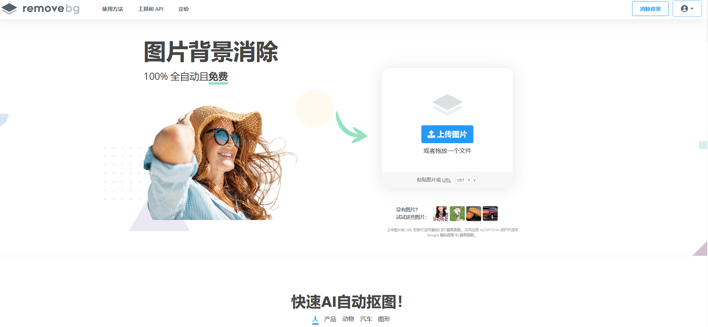
removebg是国外开发的一个基于人工智能的图片去除背景的网站，该网站提供在线调用、软件下载、开源API调用等服务，人性化设计满足不同用户的需求。接下来让我们看一下官网的处理的例子。

<span><div style="text-align: center;">
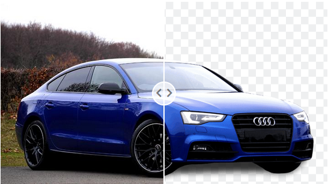
</div></span>  

<span><div style="text-align: center;">

</div></span>  

由上图可以看出，该网站对图片中事物的提取效果极好，和PS高手不分上下，小编由于好奇的原因，选取李沁小姐姐的图片进行了尝试，效果一级棒！
  

## 02 removebg的使用
官网提供了三种使用方式：在线使用、软件下载和调用api，小编对三种方式都进行了尝试。

### 1 在线使用
最简单的方式便是在线使用。
#### 1）选择消除背景（Remove Background）就进入输入图片页面。
<span><div style="text-align: center;">
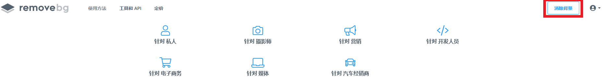
</div></span>  

#### 2）选择上传图片（Upload Image）上传自己想要提取的图片。
<span><div style="text-align: center;">
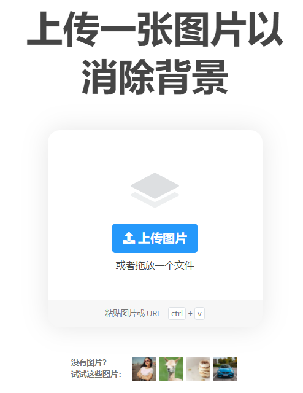
</div></span>  

#### 3）最后就可以根据需要下载想要的图片了，但是高清图是需要花钱的，预览图的分辨率基本可以满足基本需求，如果想要高分辨率图片大家可以自行付费下载。
<span><div style="text-align: center;">
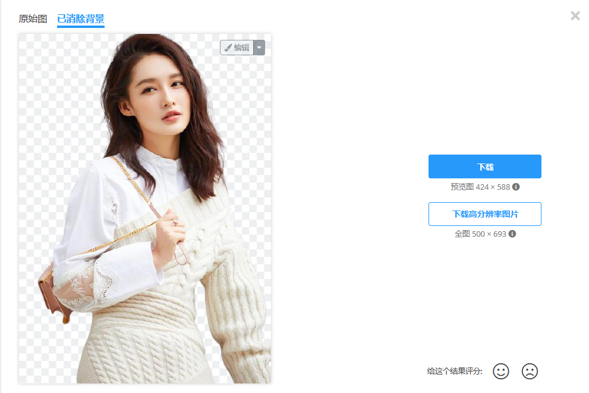
</div></span>  

### 2 软件使用
<span><div style="text-align: center;">
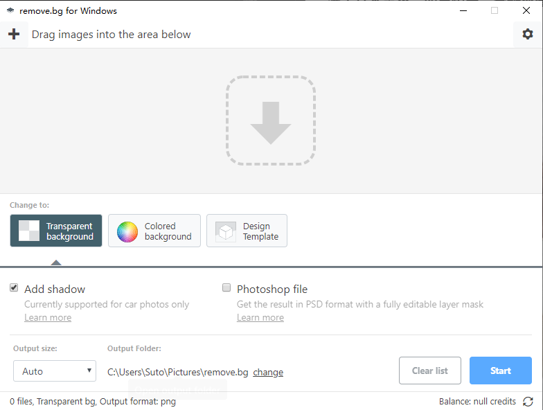
</div></span>  
软件界面如上图所示，在进行转换前，可以进行设置，通过Transparent可以设置生成无背景图和psd格式；通过Color background 可以设置背景色（默认为无色）；通过Design Template而可以添加已有的背景。

### 3 api接口的调用
#### 1）removebg 专门为开发人员设计了使用手册，点击下图中的针对开发人员，进入页面。
<span><div style="text-align: center;">
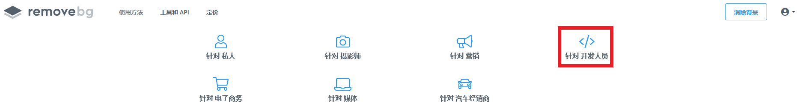
</div></span>  

#### 2）进入后点击红色框位置学习API文档
<span><div style="text-align: center;">
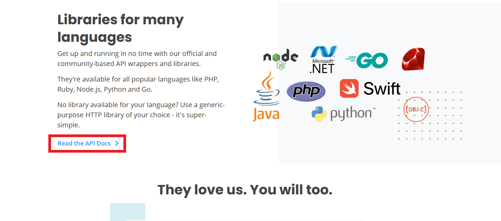
</div></span>  

#### 3）该文档详细介绍了这个API的使用方式，提供了多种语言的调用示例，并给出了基于此的接口工具，读者感兴趣可以自行查看，这里小编选取最简单的python接口进行示例教学。
<span><div style="text-align: center;">
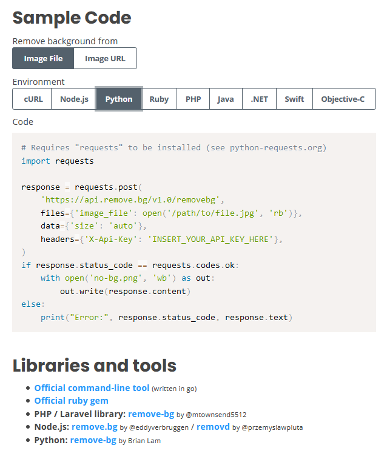
</div></span>  

## 03 使用removebg的python接口实现一键换底

官方给出了一个API接口的包装器，使得使用更加方便，其GitHub的主页为：https://github.com/brilam/remove-bg/, 在这部分小编将带大家使用removebg进行一键换底。
<span><div style="text-align: center;">
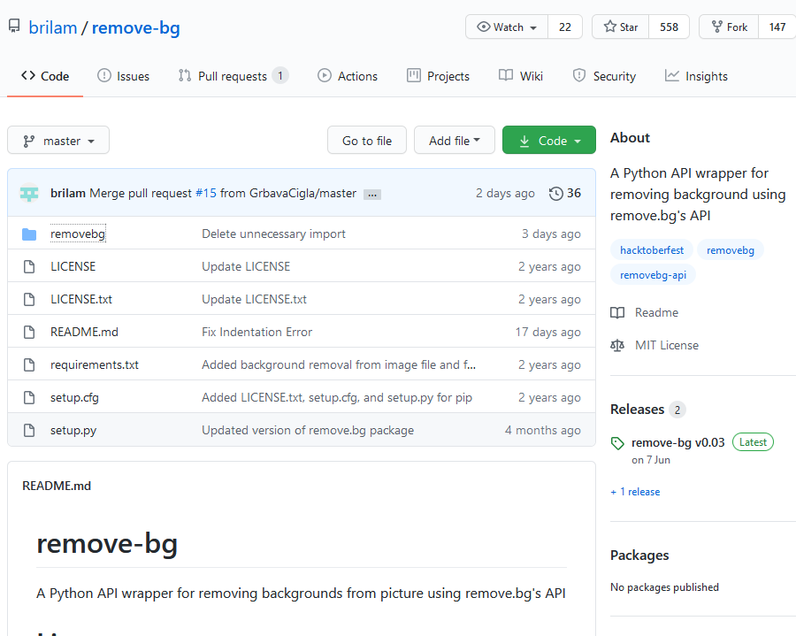
</div></span>  

### 1 库的安装
这个库的安装十分简单，只需要使用pip安装即可。
```
pip install removebg
```
### 2 API key的获取
对于开发者而言，想要调用该程序，需要在官网注册获取API key。在API文档最开始便是API key获取的链接，大家通过邮箱注册便可以获得，每个月前50次调用免费。（在线转换和软件不限次数）
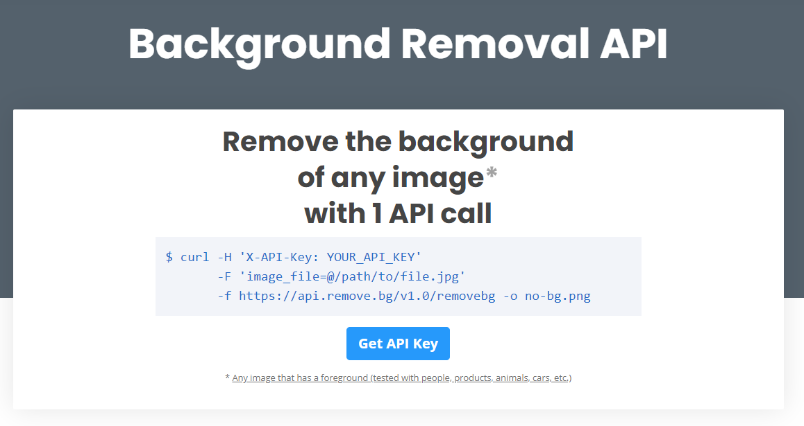
### 3 程序的调用
官方提供三种使用方式：
- remove_background_from_img_file（本地图片加载）
- remove_background_from_img_url（网页图片加载）
- remove_background_from_base64_img（base64编码字符串）
三个函数的参数基本一致，这里以remove_background_from_img_file为例进行解释，不同的只需更换第一个参数即可。

| 参数 | 是否必须 | 描述 |
| :----:| :----: | :----: |
| img_file_path | 是 | 图片格式（其他函数为对应的网页或者base64文件） |
| size | 否 | 图片像素大小， 有三个选项regular = 0.25 MP, hd = 4 MP, 4k = 10 MP，使用时size = “regular ”即可，默认为regular，调用regular以上的需要付费|
| new_file_name | 否 | 新文件名字（remove_background_from_img_file无此参数） |
| bg_color | 否 | 添加纯色背景。可以是十六进制颜色代码，默认无填充 |

**调用程序只需要三行就可以完成，简直无敌！**
```python
from removebg import RemoveBg
rmbg = RemoveBg("your api key", "error.log")
rmbg.remove_background_from_img_file("liqin.jpg",bg_color="#3366CC")
```
在上面的程序中，小编根据官网，调用api接口，注意your api key为自己的API key，在remove_background_from_img_file函数中，小编选择填充背景色为bg_color="#3366CC"（蓝色），调用该程序会自己生成liqin.jpg_no_bg.png文件，展示如下：
<span><div style="text-align: center;">

</div></span>  

为了大家“食用”方便，小编提供了十六进制颜色代码查询的链接：
https://www.cnblogs.com/summary-2017/p/7504126.html

***
小编对这个库的探索介绍就到这里，大家有没有被这个开源项目吸引到呢，反正小编是折服了。这个开源项目能帮我们做什么呢，回到最初的目的，大家想要换底的证件照可以通过它轻松完成，完成之后只需要间的resize即可，十分高效，同时大家可以发挥自己的想象，好好想下如何好好利用这个开源项目，设计出自己满意的作品。