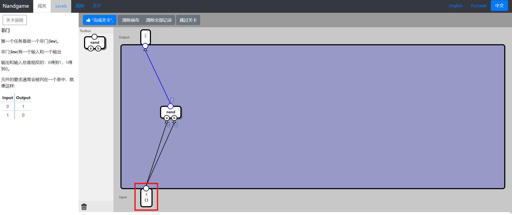
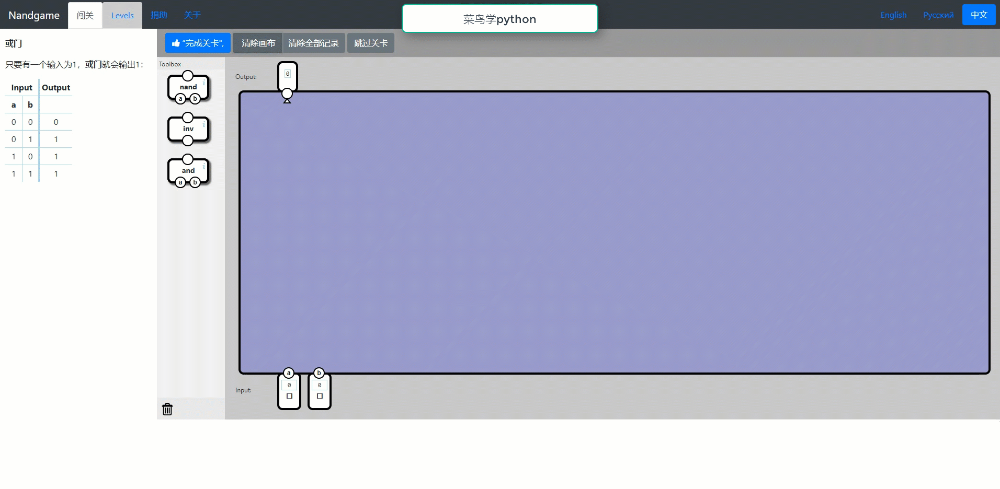

[toc]

# 通过玩游戏从零打造一款简易计算机

不知道大家在上学的时候有没有学过单片机组成原理或计算机组成原理等课程中，在课程中我们总会遇到各种与非门、ALU、内存、处理器等概念，这是一个cpu应该具备的基本结构，不知道是否也被这些概念所困扰，他们到底是如何工作的。今天小编给大家推荐的一款游戏，可以通过基本运算单元搭建一个简易的cpu，通过闯关的方式完成一个简易计算机的搭建，使玩家你能够对这些概念进一步加深理解，以玩游戏的方式进行学习，何乐而不为呢？
听了小编的介绍，你是不是已经心动了呢？快来和小编一起学习吧。

## 01NandGame介绍
### a 灵感起源
Nand Game游戏的灵感来源于课程《From NAND to Tetris - Building a Modern Computer From First Principles 》（从第一性原理建造计算机:从与非门到俄罗斯方块），这是一门备受好评的公开课，整个系列讲了怎么从与非门一路从底层到上层做出个可以玩俄罗斯方块的简易计算机，官方网页如下。
https://www.nand2tetris.org/
Nand Game只包含了其中一小部分的内容，主要用作一种有趣的练习，吸引玩家进行学习。

### b Nand Game界面介绍
Nand Game的官方网址如下：
http://nandgame.com
官方界面展示如下，提供了英文、俄文、中文三种语言的版本，整个界面包含了任务说明、部件选择区、语言选择区、页面搭建区等部分，用户可以在页面搭建区，通过搭建设计自己的设计，点击完成关卡可进行测试设计是否正确，进行下一步的优化设计。当完成一个设计之后，该设计会作为一个新的部件出现在部件选择框中，可以在后续的设计中使用。

### c Nand Game关卡介绍
点击界面中的level选项，可以查看所有的关卡。在下图中，可以看到关卡主要包含了六大部分：
- 逻辑门（Logic Gates）
- 运算器（Arithmetics）
- 管路（Plumbing）
- 内存（Memory）
- 算术逻辑单元（Arithmetic Logic Unit）
- 处理器（Processor）
这六大部分是计算机组成中所必须的，通过对他们的设计可以使得我们对计算机的工作原理更加深入的理解。

##  01NandGame实战
到这里，介绍部分就完成了，小编带大家一起进行实战设计吧。
## 01 非门的设计
第一个是进行非门的设计，提供的原始部件为一个与非门，小编在这里进行简单的设计，大家勾选输入部分对勾可以切换输入状态进行设计。

当点击完成关卡时，会弹出设计完成情况，大家可以根据完成情况进行优化设计。

## 02 与门的设计
在设计完成非门的基础上，我们就可以使用非门了，在部件处我们可以看到非门的选项了，利用与非门和非门的组合，可以很轻松的完成与门的设计，小编的设计如下，轻松过关了，可真是让人开心呢。

## 03 或门的设计
在前面两个设计的基础上，我们拥有了三个部件进行设计，这里小编以gif展示自己的操作，包含了错误提交和正确提交的效果，大家可以按照gif演示学习基础操作。

***
到这里，小编对于Nand Game的探索就结束了，不知道大家有没有心动呢，赶快行动起来吧，建议自己的计算机，拥有慢满满的成就感！