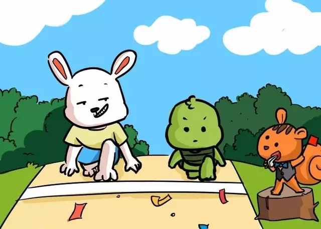
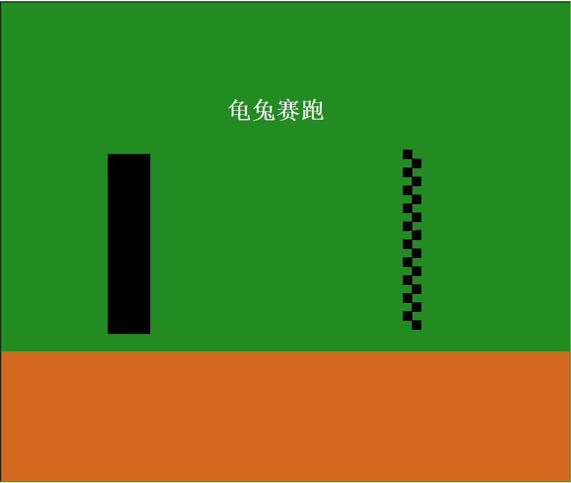
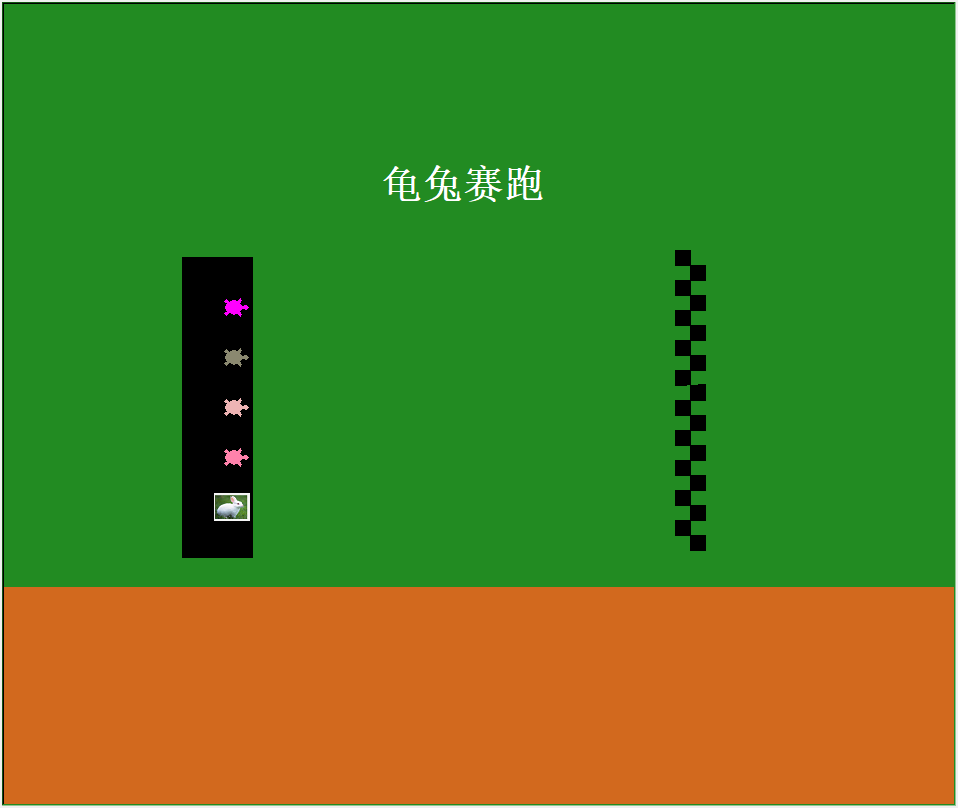
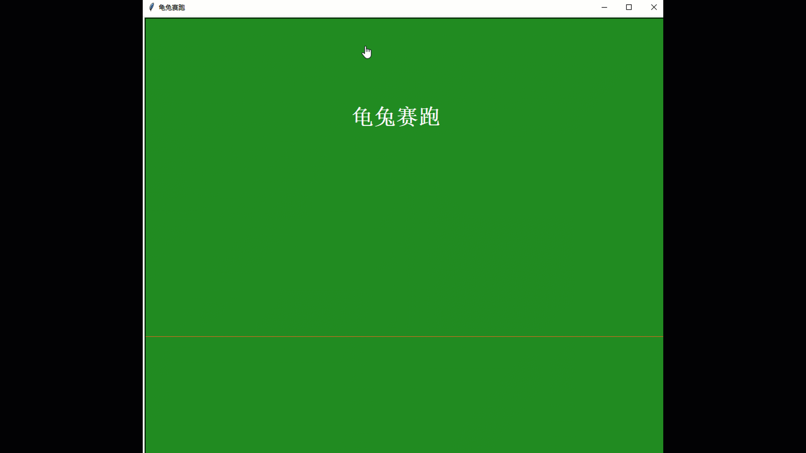

# 用Turtle进行龟兔赛跑

龟兔赛跑是伊索寓言中一个耳熟能详的故事，相信大家都是听着这个故事长大的，在故事中，偷懒的兔子输给了勤劳的乌龟，启发我们要像乌龟一样勤劳。今天，小编就带大家重温龟兔赛跑的故事，使用turtle库进行龟兔赛跑的绘制。


<span><div style="text-align: center;">

</div></span>  

## 01 turtle库的介绍
turtle库是python中最常使用的一个库，也是python语言入门的首选库，通过模拟一只海龟在面板上进行爬行绘制想要的图案，受到了python玩家的极大欢迎。
在python的官方文档中，提供了许多精美图案的绘制，感兴趣的可以前往学习，链接如下：
https://docs.python.org/3.7/library/turtle.html

在这里，小编将介绍在本次绘制中使用的基本命令，方便大家进行下一步的学习。
|  命令   | 说明  |
|  ----  | ----  |
| turtle.Screen()  | 定义窗口对象 |
| turtle.bgcolor()  | 设置背景颜色 |
| turtle.color()  | 画笔颜色 |
| turtle.speed()  | 绘制速度 |
| turtle.penup()  | 提起笔移动，不绘制图形，用于另起一个地方绘制 |
| turtle.pendown()  |  	移动时绘制图形，缺省时也为绘制 |
| turtle.setpos()  | 将画笔定位到某个坐标 |
| turtle.write()  | 绘制文字 |
| turtle.begin_fill()  | 准备开始填充图形 |
| turtle.end_fill()  | 隐藏画笔的turtle形状 |
| turtle.right()  | 顺时针移动 |
| turtle.shape()  | 设置画笔形状 |
| turtle.stamp()  | 在当前位置印制小乌龟形状（光标指针形状） |


## 02 游戏绘制
熟悉了将要使用的基本命令后，将进行进一步的绘制过程，主要包含了画布的绘制、动物的设计和赛跑三个部分，下面将一步一步进行解析。


### 1） 画布绘制
画布的绘制包含了背景板、起点线、终点线的绘制，详细代码如下，效果如下。

```python
import time
import turtle
from turtle import Turtle
from random import randint

#窗口初始化
window = turtle.Screen()  #返回默认大小(400,300)
window.title("龟兔赛跑")
turtle.bgcolor("forestgreen")
turtle.color("white")
turtle.speed(0)
turtle.penup()
turtle.setpos(-100,200)
turtle.write("龟兔赛跑",font=("Arial",30,"bold"))
turtle.penup()


# 设计界面

turtle.setpos(-480,-180)
turtle.color("chocolate")
turtle.begin_fill()
turtle.pendown()
turtle.forward(1000)
turtle.right(90)
turtle.forward(300)
turtle.right(90)
turtle.forward(1000)
turtle.right(90)
turtle.forward(300)
turtle.right(90)
turtle.end_fill()

#起点线
turtle.penup()
turtle.setpos(-300,150)
turtle.color("black")
turtle.begin_fill()
turtle.pendown()
turtle.forward(70)
turtle.right(90)
turtle.forward(300)
turtle.right(90)
turtle.forward(70)
turtle.right(90)
turtle.forward(300)
turtle.right(90)
turtle.end_fill()


# 终点线
stamp_size = 20
square_size = 15
finish_line = 200

turtle.color("black")
turtle.shape("square")
turtle.shapesize(square_size/stamp_size)
turtle.penup()
for i in range(10):
    turtle.setpos(finish_line,(150-(i*square_size*2)))
    turtle.stamp() # 在当前位置印制小乌龟形状（光标指针形状）

for j in range(10):
    turtle.setpos(finish_line+square_size,((150-square_size)-(j*square_size*2)))
    turtle.stamp()
```
关于背景板中起点线、布局、以及题目的绘制，根据尺寸确定好点的位置，进行绘制填充即可，在这里主要介绍下关于终点线的绘制，首先将光标设置为方块，在指定坐标进行盖章操作，便可得到终点线的图案。

### 2） 动物绘制
在选择动物图标时，因为turtle库中设计中已经包含了turtle图案，不需要进行设计替换，而兔子在库中是没有提供的，小编通过资料的查询，使用turtle.register_shape("tuzi.gif")，turtle.shape("tuzi.gif")命令进行了替换，所选的图片格式必须为.gif后缀，否则系统将会报错。
```python
def turtle_make(turtle_name,colors,position):
    turtle_name.speed(0)
    turtle_name.color(colors)
    turtle_name.shape("turtle")
    turtle_name.penup()
    turtle_name.goto(position)
    turtle_name.pendown()

# 乌龟初始化
turtle1 = Turtle()
turtle_make(turtle1,"magenta",(-250,100))
turtle2 = Turtle()
turtle_make(turtle2,"LemonChiffon4",(-250,50))
turtle3 = Turtle()
turtle_make(turtle3,"RosyBrown2",(-250,0))
turtle4 = Turtle()
turtle_make(turtle4,"PaleVioletRed1",(-250,-50))

# 兔子  替换图标
turtle.speed(0)
turtle.setpos(-250,-100)
turtle.register_shape("tuzi.gif")
turtle.shape("tuzi.gif")
turtle.penup()
turtle.goto(-250,-100)
turtle.pendown()
```
在进行多个乌龟的设计时，调用Turtle类，创建多个对象作为乌龟对象，并通过turtle_make(turtle_name,colors,position)函数对其进行初始化，使其有序排列，兔子的方位仍是同样的方法。绘制的整体效果如下图所示。

### 3） 赛跑
完成了画布和动物的设计之后，便要进行动物跑步的设计，考虑到乌龟和兔子的运动关系，乌龟运动速度在（1，5）之间随机进行选择，兔子速度则为（4，8），此外，兔子还有睡觉行为。比赛的规则是，当其中一方率先到达终点后，便停止比赛，公布第一名的成绩。
```python
# 显示第一名
chengji = Turtle()
chengji.penup()
chengji.color("red")
chengji.setpos(-200,300)


for i in  range(145):
    # 乌龟运动
    turtle1.forward(randint(1,5))
    turtle2.forward(randint(1,5))
    turtle3.forward(randint(1,5))
    turtle4.forward(randint(1,5))
    # 兔子运动
    if(randint(1,5)<=2):
        turtle.forward(randint(4,8))
    else:
        pass  # 睡觉
    if(turtle1.xcor()>=205):
        chengji.pendown()
        chengji.write("turtle1获得冠军",font=("Arial",40,"bold"))
        break
    if(turtle2.xcor()>=205):
        chengji.pendown()
        chengji.write("turtle2获得冠军",font=("Arial",40,"bold"))
        break
    if(turtle3.xcor()>=205):
        chengji.pendown()
        chengji.write("turtle3获得冠军",font=("Arial",40,"bold"))
        break
    if(turtle4.xcor()>=205):
        chengji.pendown()
        chengji.write("turtle4获得冠军",font=("Arial",40,"bold"))
        break
    if(turtle.xcor()>=205):
        chengji.pendown()
        chengji.write("兔子获得冠军",font=("Arial",40,"bold"))
        break

```
在程序中，我们可以看到，对于乌龟，采用随机速度进行爬行，每次循环都“勤奋”的进行爬行，而兔子虽然速度更快，但会存在“偷懒”（随机睡眠），影响整体进程。在for循环中，每只动物依次运行，由于其程序刷新率远大于人眼，人眼会看到同时运动的情形。当五只动物中任意一只到达终点时，比赛结束。演示效果如下图所示。

***
看完演示，是不是有一种童年的感觉呢，如果身边有小孩子的话，可以和小朋友分享这个教程，让他自己动手实现这个程序，满满的成就感呢！
